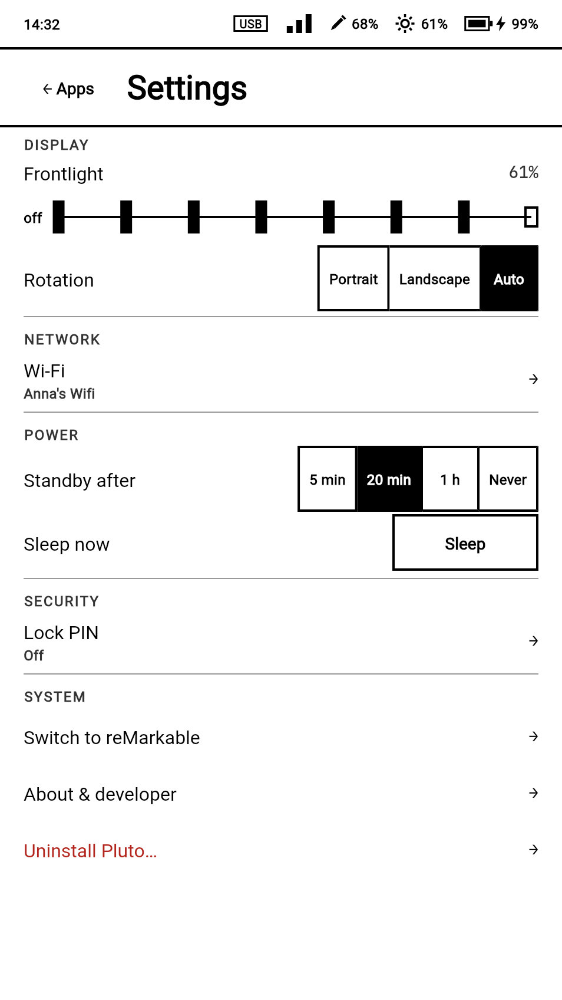
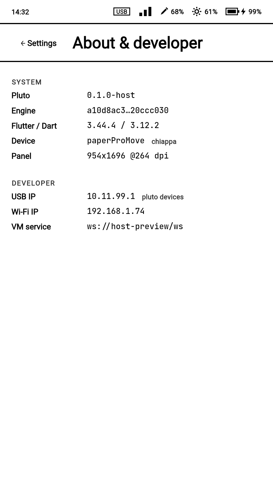
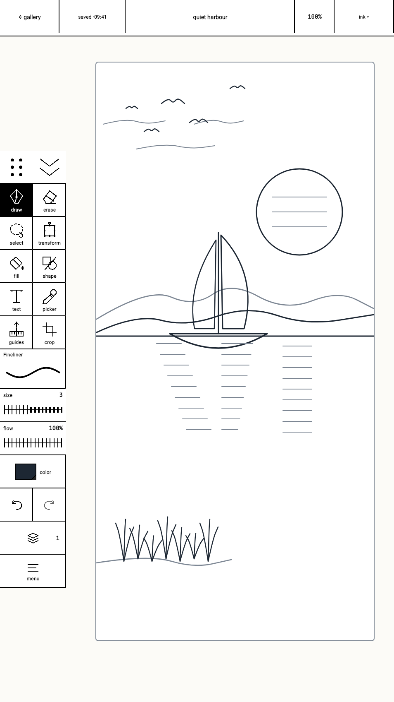
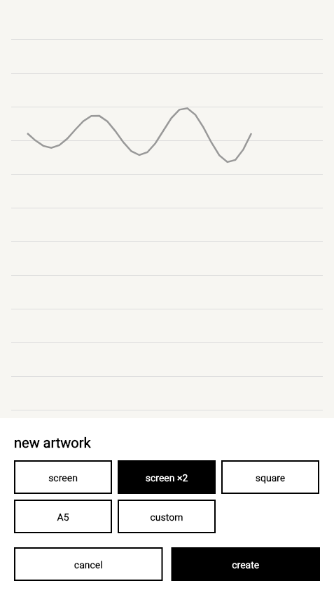
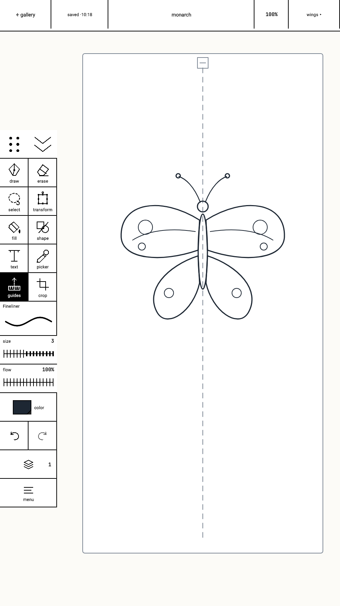
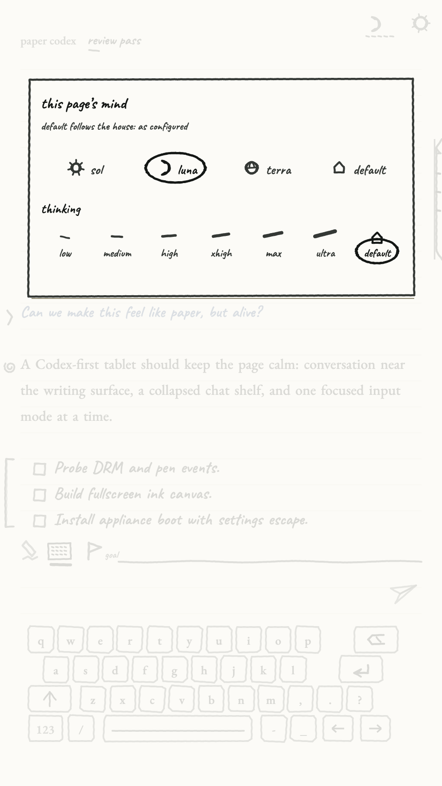
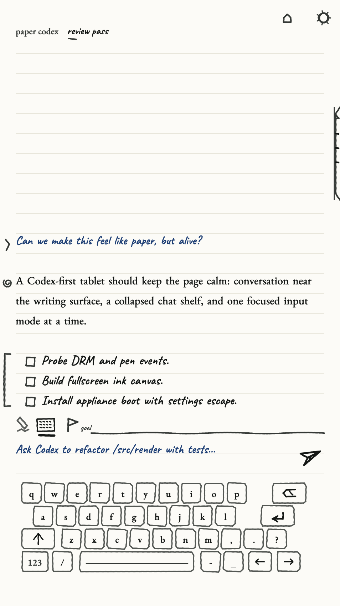
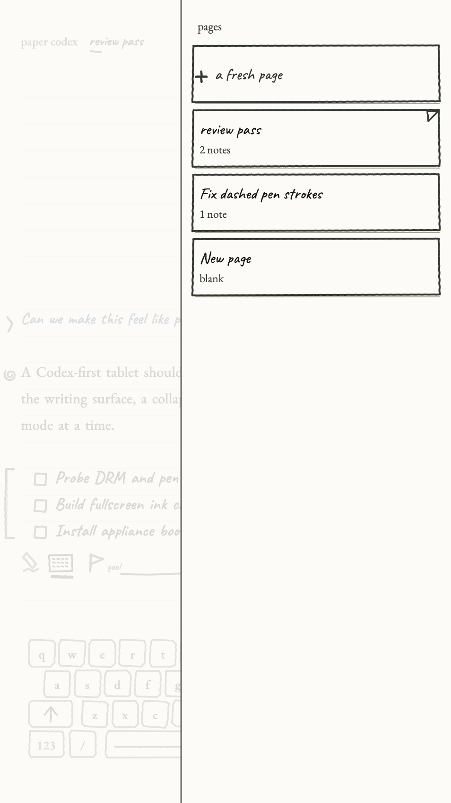

<p align="center">
  
</p>

<h1 align="center">Pluto</h1>

<p align="center"><b>Build your own UI and apps for reMarkable e-ink tablets.</b><br>
Build, install, and run real apps on e-ink, powered by Flutter.</p>

---

<table>
  <tr>
    <td width="33%" align="center"><br><sub><b>Standby</b> — the launcher at rest</sub></td>
    <td width="33%" align="center"><br><sub><b>Ink</b> — the drawing app</sub></td>
    <td width="33%" align="center"><br><sub><b>Paper Codex</b> — coding on paper</sub></td>
  </tr>
</table>

Pluto runs real Flutter apps on supported reMarkable e-ink tablets. You write
an ordinary Flutter app; Pluto renders it with e-ink-aware refresh,
damage-aware drawing, low-latency pen input, and touch.

There is one Pluto workflow. `pluto devices` identifies the connected tablet,
and device-facing commands select the matching display and lifecycle backend
internally. App authors use the same `provision`, `install`, `run`, `logs`,
`screenshot`, and `uninstall` commands on every supported device.

Pluto brings its **own UI and UX to the tablet**: a paper-styled Home,
application management, settings, Ink, Paper Codex, and a growing ecosystem of
Flutter apps. Hardware integration details stay below that product boundary,
and the stock reMarkable notes data remains untouched.

As an app author you get:

- **The `pluto` CLI** — discover, provision, install, run, inspect, and remove
  Pluto apps through one command surface; device-aware builds select the
  matching native target too.
- **`pluto_*` Dart packages** — device identity, settings, pen, touch, sensors,
  and paper-styled UI primitives.
- **Release AOT by default** — production apps are ahead-of-time compiled and
  run without a Dart VM service. Debug/JIT is always an explicit development
  capability, never the release or boot default.

## Tested devices

The status below records real hardware, not compatibility inferred from a CPU
or a successful SSH connection. Exact validation details live in
[`docs/device-compatibility.md`](docs/device-compatibility.md).

| Device | Codename | Tested reMarkable OS | Release status |
| --- | --- | --- | --- |
| reMarkable Paper Pro Move | `chiappa` | 3.28.0.162 | ✅ Reference device; release platform, Ink, and Codex validated |
| reMarkable 2 | `zero-sugar` | 3.28.0.162 | 🧪 Native CPU/scan pipeline verified; final supported-app acceptance pending |
| reMarkable 1 | `zero-gravitas` | 3.27.3.0 | 🧪 Runtime and real-panel path verified; final supported-app acceptance pending |

Only the first row currently represents completed end-to-end application
acceptance. The two legacy tablets will be promoted only after the same frozen
release passes visible Home, switching, the supported app set, and Ink runs;
Paper Codex is not an RM1/RM2 requirement because upstream has no native ARMv7
release. This README
does not treat host tests, CPU-only bring-up, or a synthetic UI as panel
acceptance.

## Built-in apps

Pluto is young, so it does not ship many apps yet—but building your own is
easy, and you can keep it private or [contribute it back](#build-an-app-for-pluto).

### Home

**Installed by default.** Pluto Home is the paper-styled app grid, settings,
and device information: the common entry point for every other Pluto app.

<table>
  <tr>
    <td width="33%" align="center"><br><sub>Home</sub></td>
    <td width="33%" align="center"><br><sub>Settings</sub></td>
    <td width="33%" align="center"><br><sub>About &amp; developer</sub></td>
  </tr>
</table>

### Ink

**Optionally installable.** A drawing app built for e-ink: a canvas you pan,
zoom, and rotate, with brushes, layers, selection and transform tools, guides,
and symmetry.

<table>
  <tr>
    <td width="33%" align="center"><br><sub>Canvas</sub></td>
    <td width="33%" align="center"><br><sub>New artwork</sub></td>
    <td width="33%" align="center"><br><sub>Symmetry tool</sub></td>
  </tr>
</table>

### Paper Codex

**Optionally installable on `linux-arm64`.** A Codex-first paper notebook: pick
the model and thinking effort, converse on a calm writing surface, and flip
through a shelf of pages. Pluto does not maintain a custom ARMv7 Codex port.

<table>
  <tr>
    <td width="33%" align="center"><br><sub>Model settings</sub></td>
    <td width="33%" align="center"><br><sub>Conversation</sub></td>
    <td width="33%" align="center"><br><sub>Page shelf</sub></td>
  </tr>
</table>

## Build an app for Pluto

**1. Install the pinned toolchain and CLI:**

```bash
./tools/setup/setup.sh
export PATH="${PLUTO_BIN_DIR:-$HOME/.pluto/bin}:${PUB_CACHE:-$HOME/.pub-cache}/bin:${PLUTO_SDK:-$HOME/.pluto/sdk/3.44.4}/bin:$PATH"
```

**2. Connect a tablet and let Pluto identify it:**

```bash
DEVICE=root@10.11.99.1  # or the SSH endpoint reported for this tablet
pluto doctor --probe-usb
pluto devices --device "$DEVICE" --probe
```

The probe reports the verified model, firmware, native target, supported build
modes, common capabilities, and provisioning state without exposing a second
backend workflow.

**3. Provision a prepared release payload.** The CLI probes the device before
writing anything and chooses the matching payload and integration internally:

```bash
pluto provision --device "$DEVICE"
pluto provision --device "$DEVICE" --status
```

Repository release maintainers prepare every supported target before
distribution. The target-specific build mechanics are deliberately kept in
the [engineering playbook](AGENTS.md) and
[AOT runtime reference](docs/aot-runtime.md), outside the app-facing device
workflow.

**4. An app is a Flutter app plus a `pluto.yaml` manifest** containing its id,
name, version, icon, and display preferences. The examples under
[`apps/examples/`](apps/examples/) are the template to copy.

`display.scale` defaults to `auto`, so Flutter receives the connected
presenter's native surface dimensions and device pixel ratio. Numeric scales
are rejected; apps lay out from Flutter's live window metrics.

Build, install, and run the release app with the same device endpoint. Build
probes the device and selects the matching native target automatically:

```bash
cd apps/examples/counter
pluto build package --device "$DEVICE" --release
pluto install --device "$DEVICE" --release --force build/pluto/app.plap
pluto run --device "$DEVICE" --release dev.pluto.examples.counter
pluto logs --device "$DEVICE"
pluto screenshot --device "$DEVICE" -o shot.png
```

The guided walkthrough—including release preparation, recovery, and the
target/build-mode capability table—is in
[`docs/GETTING_STARTED.md`](docs/GETTING_STARTED.md).

## Working on Pluto itself

Building the embedder, e-ink renderer, launcher, or platform runtime is a
different job from writing an app. Start here:

- [`AGENTS.md`](AGENTS.md) — the full engineering playbook: toolchain, engine
  rebuild, device workflow, tests, benchmarks, runtime targets, and CLI.
- [`CONTRIBUTING.md`](CONTRIBUTING.md) — development workflow, quality gates,
  and project rules.
- [`docs/`](docs/README.md) — runtime, rendering, and design references.

## License

Apache License 2.0 — see [`LICENSE`](LICENSE).

## Disclaimer

Pluto is an independent, community project. It is **not affiliated with,
endorsed by, or sponsored by reMarkable AS**. "reMarkable" and any related
names, logos, and trademarks are the property of their respective owners and
are used here only to describe hardware compatibility. Pluto is provided "as
is", without warranty of any kind; you run it on your own device at your own
risk.
