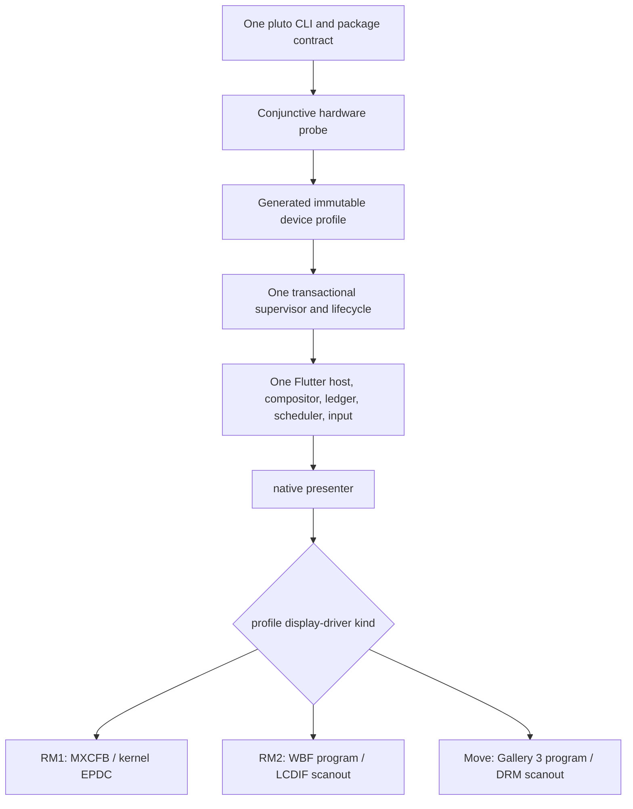

# Native display architecture

Pluto has one product runtime for every supported reMarkable tablet. The CLI,
package contract, on-device supervisor, Flutter host, compositor, frame ledger,
refresh policy, input pipeline, application lifecycle, recovery flow, and user
documentation are shared. Exact hardware identity selects one native panel
driver inside that common runtime.

The public workflow never asks for a display backend:

```bash
DEVICE=root@10.11.99.1

pluto devices --device "$DEVICE" --probe
pluto provision --device "$DEVICE"
pluto build package --device "$DEVICE" --release
pluto install --device "$DEVICE" --release --force build/pluto/app.plap
pluto run --device "$DEVICE" --release dev.pluto.launcher
pluto logs --device "$DEVICE"
pluto screenshot --device "$DEVICE" -o shot.png
```

`linux-arm` and `linux-arm64` are private build slices, not separate products.
An application package records one exact slice. Device-aware commands probe the
tablet and choose it automatically; offline release automation may name a slice
explicitly, but a value that contradicts a live probe is rejected before a
device write.

## Routing boundary

The only source of model routing data is
[`config/device_profiles.json`](../config/device_profiles.json). The
deterministic profile generator emits matching C++, Dart, and BusyBox shell
tables. CI regenerates all three and rejects drift.



Profile selection is conjunctive and fail-closed. It binds the codename, board
and compatible strings, CPU ABI, exact firmware build, exact kernel release,
display geometry, input identities, panel signature, and accepted waveform
digest. Geometry, architecture, a device node, or a marketing name alone is
never enough. The host probe selects the release slice before provisioning,
and the embedder independently verifies the installed profile before its first
display write.

Higher layers branch on capabilities such as color, frontlight, build mode,
handoff support, and real completion. A model identifier is valid only in the
generated selector, the native driver factory, and code implementing that
profile's named hardware contract.

## Common runtime

Every device installs beneath `/home/root/pluto` and uses the same scripts:

- `pluto-session.sh` owns foreground launch, warm hibernation, the running-app
  switcher, Home, standby, health receipts, and bounded recovery;
- `pluto-boot-install.sh` transactionally stages the boot-first service and a
  verified stock rescue path;
- `pluto-boot-confirm.sh` binds readiness to the current boot, supervisor, app,
  profile, and monotonically advancing completion-backed health receipt;
- `pluto-uninstall.sh` restores the stock service before removing Pluto;
- `pluto-controlctl` exposes the peer-authenticated screenshot and real-device
  Ink acceptance controls used by the CLI and hardware smoke test.

The service is intentionally named `xochitl.service`: Pluto's boot-first unit is
the validated replacement for that one display owner. While Pluto is running,
there is no stock child UI. When Pluto is restored or removed, the original
stock unit becomes the display owner again.

Release is the default and only bootable application mode. An ARMv7 profile
accepts release AOT only. The AArch64 Move profile may additionally accept an
explicit profile-AOT or one-shot debug/JIT session. Product payload validation
rejects mixed modes, relabelled artifacts, unverified engines, an unexpected
ABI, or any `kernel_blob.bin` in a release layout.

## Native presenter contract

The embedder registers one device presenter named `native`. Its
`NativeDisplayBackend` contract provides:

- observational probe followed by explicit start;
- immutable damage-bearing frame submission;
- backend readiness and real idle completion;
- a settled logical snapshot;
- pen-focus hints;
- exact glass handoff staging, retrieval, and acknowledgement;
- suspend, resume, health, and fail-closed stop.

The common compositor and scheduler do not know panel ioctls or waveform
formats. The factory receives an already verified generated profile and creates
exactly one driver:

| Profile | Driver | Completion boundary | Important safety state |
| --- | --- | --- | --- |
| `rm1` | `MxcfbDisplayBackend` | matching kernel update-marker completion | exact RGB565 mirror, mapping/stride bounds, timeout and rejection rollback |
| `rm2` | `LcdifTconDisplayBackend` | final phase latch followed by safe hold | exact WBF/panel binding, rails/blank state, slot cadence, underflow and missed-phase counters |
| `move` | Gallery 3 DRM backend | DRM/panel job completion | exact `.eink` binding, rail/VCOM state, color handoff and controller health |

An acknowledged frame advances the common settled ledger only after that real
completion point. Screenshot, warm handoff, and recovery therefore cannot
promote bytes that a backend rejected or merely queued.

### reMarkable 1

RM1 exposes an i.MX EPDC framebuffer. Pluto copies exact damage into its mapped
RGB565 surface, submits an `MXCFB_SEND_UPDATE` with a unique marker, and waits
for the matching kernel completion. The kernel owns waveform execution and PMIC
sequencing.

The backend deliberately retains one exact full-frame mirror. It is both the
settled screenshot/handoff source and the rollback authority when a submission
is rejected after framebuffer bytes have been written. A generated 65,536-entry
RGB565-to-optical table removes repeated component arithmetic from handoff state
construction. The table is deterministic and exhaustively compared with the
arithmetic definition in tests.

### reMarkable 2

RM2 exposes LCDIF scanout rather than the EPDC update API. Pluto reads the exact
device-owned WBF selected by the accepted profile, validates its digest and
panel signature, decodes the required modes, and compiles transition data into
immutable in-memory tables. Vendor waveform bytes are not copied into the
repository.

For each accepted job, the backend advances the logical optical state, encodes
phase buffers into the kernel-reported framebuffer mapping, pans slots at the
profile cadence, waits for the current-frame boundary, and finishes in the
known safe hold. Any identity, geometry, temperature, timing, allocation,
underflow, rail, or phase fault stops the sequence and reports unhealthy state;
it does not fall through to another waveform or panel path.

The SY7636A exposes live power-good separately from a historical fault-event
latch. Pluto records the exact latch while LCDIF is synchronously powered down,
then requires live power-good and the unchanged latch before and after the
powered temperature read, immediately before phase zero, and after the final
safe-idle pan. A stable pre-existing latch is retained as telemetry; an
unreadable attribute, lost power-good, or any latch transition fails closed.
Cold INIT has the same post-drive gate. Software optical state and completion
callbacks advance only after that final check, so a fault caused during a
waveform cannot be reported as a successful frame.

### Paper Pro Move

Move keeps its established Gallery 3 program and DRM scanout implementation
behind the same native contract. Device constants such as geometry, accepted
`.eink` digest, input paths, frontlight, power controls, cadence, and recovery
strategy come from the generated Move profile. The common lifecycle owns app
switching, exact-color handoff, pen preview/truth, and ghost maintenance just as
it does on the monochrome tablets.

## Warm application lifecycle

The supervisor starts one foreground release process and may retain stopped,
resource-detached apps in a bounded warm LRU. The profile owns the total
resident-process limit: two on RM1 and four on RM2 and Move. There is no
production environment override. This keeps the same switcher and lifecycle
protocol while respecting RM1's smaller memory envelope.

Before a process is stopped it must acknowledge native-resource quiescence. A
process that fails to acknowledge is killed and later cold-launched. On a warm
switch, the outgoing backend serializes digest-bound glass state and the new
backend imports it before presentation. RM1 keeps RGB565 mirror state separate
from derived optical history; RM2 includes settled logical and waveform state;
Move includes exact color state. A missing, stale, corrupt, mismatched, or
unacknowledged handoff fails closed to a normal redraw.

## Recovery boundary

Recovery protects the current install without preserving old Pluto formats or
implementations. Provisioning validates the complete target before mutation,
stages a boot attempt, arms the profile's stock rescue mechanism, and confirms
only after the supervisor and foreground release app publish matching live
receipts. A bounded failure selects stock. Restore and uninstall first prove a
working stock owner, then retire Pluto.

Unknown firmware or panel variants are unsupported until their exact profile,
safety data, tests, real-device measurements, and optical acceptance land
together. There is no filename fallback, nearest-profile guess, or runtime
backend selector.

## Verification contract

Host proof includes deterministic generation, shell contracts, CLI/package
tests, native debug and release tests, parser and rectangle sanitizers, ARMv7
and AArch64 ELF/ABI gates, both product payloads, and the complete CI gate.

That is necessary but not sufficient. The final release artifact set must be
installed on RM1, RM2, and Move and prove, on each physical panel:

1. camera-visible Pluto Home;
2. every standard release app starts with advancing completion-backed health;
3. the running-app switcher opens and another app becomes foreground;
4. Ink receives a deterministic Flutter pointer stroke and visibly renders it;
5. Home returns and the common supervisor remains healthy;
6. process identity, installed hashes, screenshots, logs, health receipts, and
   camera frames agree;
7. restore, stock repaint, and residue audits succeed when that recovery gate
   is exercised.

See [native-cutover-report.md](native-cutover-report.md) for the exact-device
benchmark and release-acceptance record.
