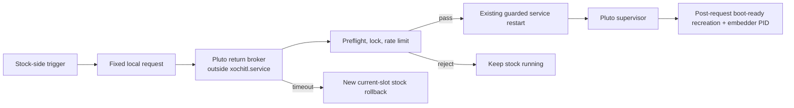

# Returning from reMarkable UI to Pluto without reboot

Date: 2026-07-14

Status: research and transient attached-device verification only. No persistent
stock-UI injection, XOVI payload, document watcher, or new device service was
installed by this work. The trigger prototype lived under `/run`, used
transient `systemd-run` units, and was removed after the tests.

> This is a historical Paper Pro Move investigation. The later cooperative
> XOVI/AppLoad/QTFB bring-up for reMarkable 1/2 is a different internal
> integration path behind the same Pluto workflow; its current status and
> recovery boundary live in
> [Device compatibility](device-compatibility.md). Statements below about what
> was or was not installed apply only to this recorded Move session.

## Executive finding

The important half is proven: the attached Paper Pro Move can move from stock
reMarkable `xochitl` back to Pluto by restarting only the UI service, without
rebooting Linux. The reverse transition, Pluto to stock, was already a Pluto
feature. This research exercised both directions, observed continuous kernel
uptime, and used the repository's configured camera tool to confirm the UI on
the physical panel.

For a trigger that is least likely to break across reMarkable releases, the
best result is **not** private-QML injection. It is a small, non-exclusive Linux
input reader which recognizes a deliberately rare sequence of complete
`KEY_POWER` press/release pairs and sends one fixed request to an external
return broker. Linux's input-event ABI and the device's named power-key path
are substantially less coupled to `xochitl` internals than QML object names,
compiled resource hashes, or document-metadata write behavior.

That mechanism was exercised end to end on the attached 3.28 unit with a
transient prototype: sequence recognition, stock-only preflight, serialized
guarded service handoff, independent rollback timer, fresh-readiness checks,
continuous boot ID/uptime, and a live Pluto embedder were all verified. The
live test fed deterministic `evtest`-format events into the real on-device
watcher, however. The power input node and real single-button events were
identified, but no physical four-click trace was received during the recording
window. The physical shortcut and its lock/sleep behavior therefore remain the
one important unverified edge; the document does not claim otherwise.

Putting a **Pluto** row directly beside **Recents** and **Settings** is also
technically plausible. The public XOVI ecosystem can preload code into
`xochitl`, replace compiled Qt resources at registration time, and apply a
QMLDiff patch. AppLoad contains a concrete public patch which adds its own row
to the existing reMarkable side menu. A minimal Pluto row could use the same
seam.

It is not yet reasonable to call that UI injection safe on the attached unit,
however:

- `xochitl` has no supported public extension API; it is proprietary Qt code.
- the attached unit is on firmware `3.28.0.162`, Qt `6.10.3`, with an exact
  `xochitl` SHA-256 of
  `9e3e0372a15da25b148ac17667feb566014440e079c3e3ee504112d556ad2e10`;
- the public QML patch collections inspected for this report stop at 3.27;
- QML resource structure and hash tables are explicitly version-specific in
  the public tooling;
- a stock-side child must not restart its own systemd service directly. It can
  be killed with the rest of the service before it has verified Pluto or
  recovered stock.

The recommended design is therefore three deliberately separate pieces:

1. First build and validate a tiny, root-owned **return broker** outside
   `xochitl.service`. It accepts one fixed `return-to-pluto` request, performs
   preflight checks, rate-limits the transition, restarts through Pluto's
   existing guard, and waits for verifiable post-request Pluto readiness. It
   also needs a new current-slot stock rollback for timeout handling; the
   existing dead-man does not supply that rollback under boot-first.
2. For an untethered, release-resilient developer shortcut, use a tiny native
   reader of `struct input_event`, discover and validate the power-key node,
   never grab it away from stock, and recognize four complete short presses
   using `CLOCK_BOOTTIME`. Keep the feature manually armed and disabled when
   stock's lock state is unknown until a reliable lock-state policy exists.
3. Treat an exact-hash side-menu row as an optional polished frontend to the
   same broker. Add it only after a firmware-specific inert patch passes camera
   and failure-injection tests. Authenticated SSH/USB remains the least risky
   first trigger and recovery control.

Of the no-QML alternatives, a dedicated **Open Pluto** document is the nicest
stock-native UI hypothesis, but its `lastOpened` behavior still needs
measurement on 3.28 and official guidance discourages accessing the document
store while `xochitl` is running. The power-key reader is mechanically direct
and the most version-resilient untethered route found, but it has poorer UX and
unresolved lock/sleep semantics. Authenticated USB/SSH is still the least
magical and lowest-risk first trigger.

## Meaning of “without restarting”

This report distinguishes a device reboot from a UI-process transition:

- **No device reboot:** the kernel, filesystems, and user session stay alive;
  `/proc/uptime` does not reset. This is verified.
- **UI-process transition:** `xochitl` exits and the Pluto supervisor/embedder
  starts. This is necessary with the current architecture because both systems
  need the same display and input devices.
- **Simultaneous/co-resident UI:** not proposed. Keeping both full UIs alive and
  multiplexing their framebuffer/input ownership would require a substantially
  more invasive compositor or remux layer.

reMarkable's own developer documentation demonstrates the same process-level
model for a Qt e-paper application: stop `xochitl`, run the application, then
start `xochitl` again, without rebooting the tablet. See the official
[Qt e-paper example](https://developer.remarkable.com/documentation/qt_epaper)
and [xochitl documentation](https://developer.remarkable.com/documentation/xochitl).

## Confidence labels

The rest of this document uses three labels deliberately:

- **Verified:** observed in this repository or on the attached unit during this
  research.
- **Source-backed:** demonstrated by a named public project or official source,
  but not exercised on this exact 3.28 unit.
- **Hypothesis:** a design that follows from the evidence but still needs a
  controlled device test.

## Attached-device ground truth

| Item | Observation | Confidence |
| --- | --- | --- |
| Hardware | Paper Pro Move / `chiappa`, aarch64 | Verified |
| OS image | `3.28.0.162`; Codex Linux `5.8.198` / scarthgap | Verified |
| Qt | `6.10.3` shared libraries | Verified |
| `xochitl` | Build ID `902254733625748a029659a95eee4f8200e0b868`; SHA-256 shown above | Verified |
| Pluto boot topology | `/usr/lib/systemd/system/xochitl.service.d/zz-pluto.conf` replaces `ExecStart` with `pluto-session.sh start` | Verified |
| Stock topology | while in stock, `/usr/bin/xochitl --system` is the main process of that same service | Verified |
| Pluto readiness | supervisor uses `/run/pluto/boot-ready` | Verified |
| Restart safety | `pluto-xochitl-guard.sh` permits at most 3 recorded restarts in 600 seconds, below the OEM burst limit | Verified |
| Power input | `/dev/input/by-path/platform-44440000.bbnsm:pwrkey-event` resolves to `event0`; handler name is `44440000.bbnsm:pwrkey` and it advertises `EV_KEY` / `KEY_POWER` | Verified |
| Stock document store | `/home/root/.local/share/remarkable/xochitl`; current metadata includes string-valued `lastOpened` fields | Verified |
| Filesystem | document store is on ext4 mounted with `relatime`; access time is not an exact “user opened this” signal | Verified |
| Existing injection | `/home/root/xovi` is absent; no XOVI payload was loaded | Verified |

The official [software stack description](https://developer.remarkable.com/documentation/software-stack)
also identifies `xochitl` as reMarkable's proprietary Qt application. There is
no documented menu-extension or application-launch protocol to use instead of
an unsupported seam.

## Live handoff verification

The test deliberately used Pluto's existing paths rather than installing a
prototype. The relevant repository components are
[pluto-session.sh](../tools/device/pluto-session.sh),
[pluto-boot-install.sh](../tools/device/pluto-boot-install.sh), and
[pluto-xochitl-guard.sh](../tools/device/pluto-xochitl-guard.sh).

### What happened

1. Pluto was active as the overridden `xochitl.service`; its embedder owned the
   panel.
2. The existing `/run/pluto/stock` control marker was requested. The supervisor
   drained Pluto children and `exec`'d `/usr/bin/xochitl --system`, so stock
   remained the service's main process instead of becoming an easily reaped
   child.
3. After stock had time to paint, the camera showed the reMarkable **My files**
   screen on the glass.
4. From an SSH process outside `xochitl.service`, the existing guarded restart
   was requested. systemd re-read the persistent Pluto `ExecStart` override,
   launched the supervisor, and the Pluto embedder regained the panel.
5. A later camera observation showed the Pluto launcher. The device was left in
   Pluto.

### Evidence

| Point | Main process / observation | `/proc/uptime` |
| --- | --- | ---: |
| Before first stock transition | Pluto service and embedder active | `12725.84` s |
| First stock session | same service main PID had become `/usr/bin/xochitl` | `12736.20` s |
| First return to Pluto | new supervisor and embedder active | `12745.85` s |
| Second, longer stock dwell | `/usr/bin/xochitl`; camera visibly showed **My files** | `12852.44` s |
| Final Pluto health check | supervisor PID `248386`, embedder PID `248448`; service active | `12867.33` s |

Uptime increased monotonically throughout. That rules out a tablet reboot. The
second stock dwell was intentionally 18 seconds so the slow e-ink UI could be
identified optically; it was not a transition-latency benchmark.

These first captures were exploratory full-rig camera images. They identified
the screens but were tilted and wider than the tablet, so they are not treated
as the formal optical evidence for the trigger experiment below. No image or
camera configuration was committed.

The guard ended at `recent=2 window=600s limit=3`, so testing stopped rather
than spend the final safe restart slot. No XOVI or injected QML was tried.

## Version-resilient trigger experiment

This second experiment tested the least private-UI-coupled untethered route: a
non-exclusive power-key sequence feeding an external lifecycle owner. It was a
transient research harness, not product code. Nothing was added to the stock
filesystem or persistent systemd configuration.

### Why this route ranked first for release resilience

The three main untethered candidates fail at different boundaries:

1. A QML side-menu row has excellent UX but depends on proprietary object
   structure, compiled resource hashes, Qt hooks, and an exact firmware build.
2. A document sentinel avoids code injection but depends on private metadata
   semantics and reads the document store while stock is live, contrary to the
   official operational guidance.
3. A Linux `EV_KEY` reader depends on the kernel input ABI plus a hardware
   identity. The event number can move, but the named `by-path` link, sysfs
   identity, and advertised capabilities can be rediscovered and validated.

The Linux kernel's
[input-event documentation](https://www.kernel.org/doc/html/latest/input/event-codes.html)
defines `EV_KEY` value `1` as press, `0` as release, and `2` as repeat. That
public kernel contract is a firmer compatibility boundary than any private
`xochitl` QML or metadata assumption, although a future reMarkable hardware
revision could still expose its power key under a different identity.

That does not make option 3 automatically safe. Stock receives the same power
events, so it may sleep, wake, lock, or display its own overlay. A physical
shortcut may also cross the stock passcode boundary unless it has a reliable
lock-state gate. Those are security and interaction questions, not firmware-QML
compatibility questions.

### Transient prototype rules

The shell prototype intentionally narrowed the mechanism:

- read the named power-key path with plain `evtest`, with no `--grab` and no
  `EVIOCGRAB`;
- accept exactly four complete `KEY_POWER` down/up pairs;
- accept holds from 20 to 500 ms, at most 900 ms from one release to the next
  down, and at most 4,000 ms for the whole sequence;
- ignore auto-repeat value `2`, duplicate downs, unpaired releases, long holds,
  and expired partial sequences;
- trigger only after the fourth valid release, not on a down edge;
- verify that `/usr/bin/xochitl` is the active service main executable;
- take an exclusive `flock`, require restart-ledger `recent <= 1`, and expose no
  command, path, argument, or environment supplied by the event source;
- arm a separate 45-second rollback timer before the guarded restart;
- require a new `boot-ready` inode, a new live embedder PID, and active service
  state before reporting success, then disarm rollback.

The prototype used `/proc/uptime` for its monotonic millisecond clock because it
was available in BusyBox shell. Product code should instead read binary
`struct input_event` records directly and use `CLOCK_BOOTTIME`; parsing human
`evtest` output is appropriate only for this disposable test harness.

### Host and device verification

The detector first ran against deterministic event/clock fixtures on the host.
The positive four-pair stream triggered once. Four negative streams were also
checked: only three pairs, a long hold, an expired inter-press gap, and an
auto-repeat value `2`; none triggered.

The same scripts were then copied under `/run/pluto` and launched as transient
units on the tablet. A dry run verified that the watcher lived in
`/system.slice/pluto-stock-return-dryrun.service`, outside
`/system.slice/xochitl.service`. A deliberately too-fast 10 ms fixture was
rejected; a corrected 80–90 ms four-pair fixture triggered exactly once. The
restart ledger stayed at zero during this dry run.

The current-slot rollback configuration was separately exercised without
restarting the UI. A same-name runtime mask at
`/run/systemd/system/xochitl.service.d/zz-pluto.conf` hid Pluto's persistent
drop-in: systemd's effective configuration changed from
`pluto-session.sh start` / `Restart=no` to stock
`/usr/bin/xochitl --system` / `Restart=on-failure`. Removing the runtime mask
and reloading systemd restored the Pluto configuration. A rollback helper also
correctly did nothing when stock was already the healthy service main process.

### Live end-to-end evidence

The live run began with stock as the real `xochitl.service` main executable.
Only the event source was synthetic: a deterministic program emitted the same
`evtest` lines as four valid press/release pairs into the real on-device
detector. Everything after those lines was real—the stock-state preflight,
lock, guard, timer, systemd restart, Pluto supervisor, renderer readiness, and
health checks.

| Evidence | Before / request | After |
| --- | --- | --- |
| Kernel boot ID | `fa9a41fe-035b-442d-8a40-0235ce94032e` | unchanged |
| Uptime | trigger accepted at `15107.69` s; handoff began at `15107.80` s | Pluto ready at `15113.84` s |
| Service main | stock `/usr/bin/xochitl`, PID `248386` | Pluto supervisor shell, PID `284532` |
| Readiness | old `boot-ready` inode `1692`; no stock embedder PID | new inode `1854`; live embedder PID `284613` |
| Restart ledger | `recent=0` | `recent=1`; rollback slot still reserved |
| Rollback | independent 45-second timer armed before restart | timer inactive after fresh readiness |
| Trigger unit | separate transient service cgroup | `Result=success`, `ExecMainStatus=0`, inactive |

The measured handoff from restart request to verified Pluto readiness was
6.04 seconds. A second guarded replay produced a new readiness inode and
embedder PID with the same boot ID; it was useful as process evidence but stock
had not repainted the bistable panel before the synthetic sequence, so it is
not counted as optical transition evidence.

A final replay corrected that optical precondition. It first waited for stock
to be the service main process, allowed a 12-second paint dwell, and required a
configured camera-tool still visibly showing **My files** before starting the
video or watcher.

| Camera-verified replay | Before / request | After |
| --- | --- | --- |
| Kernel boot ID | `fa9a41fe-035b-442d-8a40-0235ce94032e` | unchanged |
| Uptime | baseline `15798.77` s; handoff began `15799.52` s | Pluto ready `15807.39` s; final audit `15866.74` s |
| Service main | stock `/usr/bin/xochitl`, PID `290323` | Pluto supervisor shell, PID `298670` |
| Readiness | old inode `1914`; no stock embedder | new inode `1966`; live embedder PID `298744` |
| Restart ledger | `recent=1` | `recent=2`; final rollback slot left unused |
| Rollback/runtime override | 45-second timer armed; no runtime stock mask | timer inactive; no runtime mask |
| Camera tool | configured device 1 visibly on stock before arming | 30-second upright video ends on Pluto launcher |

The camera-verified handoff reached fresh Pluto readiness in 7.87 seconds. A
three-second-interval contact sheet from the configured video shows five stock
samples, the panel's clearing/transition frames, and two final Pluto-launcher
samples. This is optical confirmation of the UI transition, not a claim that
the synthetic event source was a physical button press.

### Physical-input and optical boundary

The physical input device identity and capabilities were verified from udev,
`/proc/bus/input/devices`, and the `evtest` header. Existing device journals
also record real power-button wake IRQs and Pluto standby requests from this
node. During two stock-side recorder windows, however, no new physical press
events arrived. The successful live run therefore proves the detector-to-Pluto
mechanism, but not that a human four-click gesture has acceptable timing or
stock behavior.

Optical acceptance used the repository's configured
`tools/setup/camera/capture.sh` flow for numbered device 1. A configured still
verified stock before arming; the configured 30-second video then captured the
stock screen, e-ink clearing, and settled Pluto launcher. An earlier recording
which changed process state before stock repainted was explicitly rejected as
evidence. The video and derived contact sheet stayed in the host temporary
directory and were not committed.

### Product form and current verdict

A durable implementation should be a small native reader, not this shell
prototype. It should resolve the named path, verify the sysfs device name and
`EV_KEY`/`KEY_POWER` capability, use `CLOCK_BOOTTIME`, reset state across
suspend, and hand one fixed message to the external broker. It should be a
manually armed developer shortcut until lock/passcode behavior is solved, and
it should fail disabled on an unknown hardware identity or lock state.

**Verdict:** the power-key route is the best version-resilient untethered
candidate found, and its lifecycle mechanism works end to end on firmware
3.28. It is not yet a safe permanent feature: one real four-click trace plus
sleep/wake, long-hold, lock-screen, passcode, accidental-press, and suspend
tests remain mandatory.

After the final audit, all prototype scripts, markers, locks, and transient
units were removed from `/run`. Pluto remained active with the same boot ID,
`boot-ready=ready`, a live embedder, no runtime systemd mask, and restart ledger
`recent=2` of 3. The remaining slot was deliberately not spent.

## The lifecycle boundary that every trigger should use

The menu button, document watcher, key watcher, or USB action should all be
thin inputs to the same lifecycle controller. They must not each implement
their own process handoff.

### Why the broker must be outside `xochitl.service`

AppLoad's external-app backend starts programs with `QProcess`; those programs
remain descendants of `xochitl`. systemd normally stops an entire service
control group. A child which asks systemd to restart its own group may be killed
after submitting the job but before it can wait for readiness, undo a transient
configuration, or recover the stock UI.

The current Pluto boot drop-in also clears the stock watchdog and sets
`Restart=no` because the Pluto supervisor owns recovery. When the supervisor
has `exec`'d stock, a crashing experimental preload cannot be assumed to
restart itself. This makes an external broker/watchdog a safety requirement,
not just an architectural preference.

### Proposed broker contract

This is a design, not an implementation:

1. A root-owned daemon, preferably activated by its own systemd socket unit,
   listens on a Unix socket such as `/run/pluto/return.sock`. The request
   vocabulary has exactly one operation: `return-to-pluto`. It does not accept
   a command, path, environment, or shell string.
2. Socket permissions and Unix peer credentials restrict callers. The broker
   also verifies that the active service main executable is the expected
   `/usr/bin/xochitl`, so a stale document event cannot bounce an already
   running Pluto session.
3. Preflight verifies the model, firmware, exact `xochitl` hash, installed
   Pluto drop-in, supervisor and release payload, free space, service health,
   and absence of another handoff lock. It must reserve capacity for both the
   attempted restart and a possible rollback. With the present `3/600s` guard,
   a return must not begin when two restarts are already in the window.
4. It persists the trigger edge as consumed before doing anything destructive,
   records a request nonce under `/run`, and arms an independent timeout.
5. It serializes all of its requests and calls the repository's guarded restart
   rather than raw `systemctl`. The current guard is not a global lock: its
   count-and-append is unlocked, it uses wall-clock time, and older recovery
   paths can restart outside its ledger. The broker must supply the missing
   lock, reject suspicious clock jumps, and ensure every new trigger path uses
   that one serialized route.
6. The existing `/run/pluto/boot-ready` contains only `ready`, not a generation
   or nonce. The supervisor removes it and `embedder.pid` during startup, and
   the embedder atomically republishes readiness. Success must therefore either
   witness the old file disappear and a new file appear after this request,
   compare inode/timestamps against the handoff start, or extend the protocol
   with a generation. It must also validate a live embedder PID and the expected
   service main process. Merely seeing a stale marker or an accepted systemd job
   is not success.
7. On timeout, the independent broker first checks whether the supervisor has
   already `exec`'d stock through its built-in three-fast-fail fallback. If so,
   it avoids spending a second restart. Otherwise it removes only transient
   state it owns and invokes a **new** current-slot rollback which masks or fully
   reverses the persistent Pluto service properties before starting unpreloaded
   stock through the guard. The present dead-man's `restore` action ultimately
   restarts `xochitl.service`; with `zz-pluto.conf` installed that selects Pluto
   again, so it is not this rollback.

A normal reboot is not an immediate clean-stock fallback either: it boots the
current root with the persistent Pluto override. The stock peer slot is reached
only later through the bootloader's failed/unconfirmed-boot policy. Recovery
design and operator instructions must say which of those states they produce.

The helper should log the trigger kind, firmware/hash, preflight result,
restart-ledger count, readiness result, and recovery result. It should reject a
request on the lock screen unless the user explicitly chooses a physical
shortcut that is allowed to bypass that UX boundary.

## Candidate A: a direct Pluto side-menu row

### Public precedent

[XOVI](https://github.com/asivery/xovi) is an aarch64-capable `LD_PRELOAD`
framework which hooks dynamically visible functions. Its companion
[Qt resource rebuilder](https://github.com/asivery/rm-xovi-extensions/tree/master/qt-resource-rebuilder)
can replace or modify Qt resources at registration time using `.qrr`, `.qmd`,
and `.rcc` inputs. [QMLDiff](https://github.com/asivery/qmldiff) supplies the
structured QML patch format.

XOVI's own README documents a small race in its aarch64 untrampoline path and
warns that disabling its hook lock can make the system less stable. Even with
an exact QML patch, the preload should therefore remain a minimal, reversible,
unsupported component rather than being described as risk-free.

The same extension collection includes an
[xovi-message-broker](https://github.com/asivery/rm-xovi-extensions/tree/master/xovi-message-broker),
which is useful precedent for getting a fixed event out of injected UI code.
It also includes a general
[Qt command executor](https://github.com/asivery/rm-xovi-extensions/tree/master/qt-command-executor);
Pluto should deliberately not use that broader shell surface for this feature.

This is not only theoretical. AppLoad's pinned
[`appload.qmd`](https://github.com/asivery/rm-appload/blob/123c29eb2fa6d1025cb3fa1b47bece6cee0a74f6/xovi/template/appload.qmd)
patch targets the existing side menu, inserts an **AppLoad** action with a
label/icon, and supplies a click handler. AppLoad then presents QML applications
and external programs; its
[`libraryexternals.cpp`](https://github.com/asivery/rm-appload/blob/master/src/libraryexternals.cpp)
shows the `QProcess` child-launch boundary discussed above. The latest public
[AppLoad v0.5.3](https://github.com/asivery/rm-appload/releases/tag/v0.5.3)
was released in May 2026.

This provides strong source-backed evidence that the requested placement is a
real patch seam, not a guess based only on screenshots.

### Dormant Pluto/AppLoad precedent

The repository itself retains an older, non-canonical experiment in
[provision-pluto.sh](../tools/device/provision-pluto.sh). It writes an AppLoad
external manifest under `/home/root/xovi/exthome/appload/pluto` whose backend
invokes [pluto-boot-hook.sh](../tools/device/pluto-boot-hook.sh) to launch the
Pluto launcher. [provision-xovi.sh](../tools/device/provision-xovi.sh) also
contains a tethered XOVI staging path with a temporary service override and
dead-man recovery.

This is useful historical evidence that AppLoad can expose Pluto as a stock-UI
action. It should not be revived unchanged. Standard Pluto provisioning no
longer depends on XOVI, and an AppLoad backend is a child of `xochitl.service`;
the current boot-first supervisor and warm-process lifecycle need the external
broker described above. The old direct launch is a canary idea, not a current
lifecycle contract.

### Minimal Pluto variant

A direct implementation should be smaller than AppLoad:

1. Build a `.qmd` against the exact 3.28 side-menu QML resource, adding one
   **Pluto** row beside the existing navigation actions.
2. Add one tiny native/QML bridge method, `requestPluto()`. Its only effect is
   to send the fixed local broker request. Do not expose AppLoad's general
   process launcher and do not add a root command executor.
3. Disable the row after the first tap, show a short “Opening Pluto…” state,
   and let the e-ink frame settle before the broker stops stock.
4. Keep the patch and bridge keyed to the exact firmware and `xochitl` hash. On
   mismatch, load neither. Stock must remain completely unmodified.

An intermediate proof could reuse AppLoad and add an **Open Pluto** tile. That
reduces new QML work but retains a generic launcher and requires an extra tap;
it is useful as a laboratory canary, not the preferred final surface.

### What the 3.28 static checks do and do not prove

The cached May XOVI/AppLoad binaries were inspected without installing them:

- current `xochitl` still imports the device-lock constructor used as an AppLoad
  attachment point and `qRegisterResourceData`, the Qt-resource seam;
- the AppLoad library requires `Qt_6.8`, and the device's Qt 6.10.3 libraries
  export the required versioned symbols observed, alongside `Qt_6.9` and
  `Qt_6.10` symbol versions;
- it requires `GLIBCXX_3.4.32`, which the device library exports.

Those checks make loading plausible. They do **not** validate the private QML
object tree, resource hashes, button geometry, signal names, lifecycle, or
crash behavior.

As of 2026-07-14, the inspected public per-version QMD trees in
[FouzR/xovi-extensions](https://github.com/FouzR/xovi-extensions) and
[NohamR/xovi-qmd-extensions](https://github.com/NohamR/xovi-qmd-extensions)
contain 3.27 variants but no 3.28 directory. Their instructions select QMDs by
software version, and the resource rebuilder's documentation warns that
frontend changes can break QMD patches and that its resource hash table must be
rebuilt after an update. The tripletap project's version-awareness instructions
likewise keep separate resource-rebuilder directories and hash tables per OS
version.

Therefore an old 3.27 patch should never be tried on 3.28 “to see if it works.”
The next legitimate experiment is to extract/diff the exact 3.28 resources,
build the matching table and a no-op/inert menu patch, and test it tethered.

### Integrating XOVI with Pluto's service override

The current Pluto-to-stock path directly `exec`s unpreloaded `xochitl`; it does
not set XOVI's `LD_PRELOAD`. Upstream XOVI startup scripts also expect to
control the stock `xochitl.service`, while Pluto persistently replaces that
service's `ExecStart`. Running the upstream script unchanged risks conflicting
drop-ins and obscuring the recovery path.

Two integration shapes are plausible:

- **Direct-exec stock session:** the supervisor starts a hash-pinned XOVI
  preload only when the user deliberately chooses stock. If the preload or
  patch is absent/mismatched, it executes the unpreloaded stock binary instead.
  In both cases it still runs under Pluto-owned service properties such as
  `Restart=no` and `WatchdogSec=0`; this is not full OEM service behavior.
- **Transient stock-XOVI service configuration:** a same-name, higher-priority
  runtime mask at
  `/run/systemd/system/xochitl.service.d/zz-pluto.conf` shadows the persistent
  file of the same name and restores the base OEM unit, while a separate
  Pluto-owned drop-in under
  `/run/systemd/system/xochitl.service.d/` adds only the pinned preload. An
  `ExecStart` override with a lexically later name is insufficient by itself:
  it would still inherit Pluto's cleared `OnFailure`, disabled watchdog,
  `Restart=no`, and `PLUTO_ROOT` environment. The return broker removes both
  runtime files, reloads systemd, and performs the guarded restart into Pluto.
  Reboot clears the runtime files and re-exposes the persistent Pluto override;
  it does not boot clean stock on the current root.

The first has fewer service transitions; the second makes ownership and
rollback more explicit. Either requires shell-contract tests for drop-in
ordering and a tethered crash test. It must preserve Pluto's A/B stock rescue
and dead-man behavior. The
[XOVI extension repository](https://github.com/asivery/rm-xovi-extensions)
explicitly advises against blindly autostarting experimental injection at boot;
it specifically warns that untethered changes to the encrypted tablet's stock
`xochitl` boot service can cause a boot loop. The Pluto integration should keep
that conservative, recoverable property rather than treating Pluto's existing
override as permission to layer in a second unmanaged one.

Current restore/uninstall scripts do not know about these proposed runtime
masks and preload drop-ins. Any implementation must extend those paths to
remove only Pluto's owned files and regression-test interrupted install,
restore, uninstall, and reboot cases.

**Verdict:** best target UX and technically credible, but **not ready for live
3.28 deployment** until an exact-version inert patch and recovery path pass.

## Candidate B: an “Open Pluto” document sentinel

The user's document idea avoids patching `xochitl` code at all:

1. Import a normal one-page PDF named **Open Pluto** through reMarkable's normal
   document path, favorite it, and resolve its stable UUID once.
2. A separate stock-side watcher records that UUID's metadata baseline when
   stock starts.
3. When the exact document's `lastOpened` value makes a strictly newer edge,
   the watcher persists the edge as consumed and sends the fixed broker
   request.
4. On returning to stock, it seeds a new baseline and ignores startup churn.

reMarkable's official [xochitl documentation](https://developer.remarkable.com/documentation/xochitl)
describes the on-device document path and UUID-grouped layout. Older metadata
inspection examples from
[Michael Dimmitt](https://gist.github.com/MichaelDimmitt/90985a542f4ce117e28d2fe159d2082d)
and [Utopiah](https://gist.github.com/Utopiah/e2d5c944bbd632e3ae0530e602977f45)
show `.metadata` fields including `lastOpened`.
On the attached unit, the two stock tutorial documents had metadata with
`lastOpened: "0"`. No tutorial was intentionally opened during this research,
so the write timing on firmware 3.28 remains unverified.

There is an important safety caveat: the official documentation says xochitl
should not be running when the stored documents are accessed or changed. A
read-only metadata watcher is less likely to corrupt data than a writer, but it
still operates outside that recommended access pattern and can observe a
partially replaced file. It must never edit xochitl's sidecars, must tolerate
parse/rename races, and remains unsupported even if the semantic edge proves
reliable.

### Watch the semantic sidecar, not file access

Watching the PDF inode for `open(2)` is unsafe: indexing, thumbnails, sync, or
prefetch can read it without a user opening the document. Access time is also
unsuitable because the current filesystem uses `relatime`.

The watcher should monitor the containing directory, then re-read only the
known UUID's metadata and compare the parsed field. A directory watch is
important because applications often replace a JSON file by rename, which
invalidates a watch on the old inode. Linux
[`inotify`](https://www.man7.org/linux/man-pages/man7/inotify.7.html) or a
[`systemd.path`](https://www.man7.org/linux/man-pages/man5/systemd.path.5.html)
wakeup can provide the notification, but neither supplies the meaning; the
strict value comparison, startup grace period, durable consumed edge, and
debounce do.

Potential false positives that must be measured include cloud synchronization,
document import, preview rendering, xochitl restart, opening the document on
another device, clock correction, and metadata schema changes. A safer variant
could require two deliberate semantic edges, such as opening a tiny notebook
and adding a stroke on a named page, but that makes the UX less elegant and
touches more internal file formats.

### Required verification

Before using this trigger, record the exact sidecars before, during, and after:

- 20 intentional opens from My files;
- 20 preview/selection/favorite/rename operations which must not trigger;
- xochitl cold start, sleep/wake, Wi-Fi sync, USB import, and a remote edit;
- repeated opening of the already-open sentinel;
- a clock jump and a stale persisted baseline.

The camera should correlate the visible document-open state with each metadata
edge. Triggering is acceptable only if a rule gives zero false positives in the
negative set and exactly one edge per deliberate action.

**Verdict:** low code-injection risk and good discoverability, but **plausible,
unsupported, and not verified on 3.28**. It is an interesting stock-native
experiment, not automatically a safer production path than a version-pinned
menu patch.

## Candidate C: a power-button sequence

[xovi-tripletap](https://github.com/rmitchellscott/xovi-tripletap) is public
source-backed precedent for detecting three power-button presses on reMarkable
devices; its repository README advertises Paper Pro Move support. Its current
[v1.1.0](https://github.com/rmitchellscott/xovi-tripletap/releases/tag/v1.1.0)
release dates from May 2026.
Its current
[`main.sh`](https://github.com/rmitchellscott/xovi-tripletap/blob/main/main.sh)
reads key code 116. In the inspected commit, it compares adjacent down events
against a two-whole-wall-clock-second limit; it is not a strict two-second
window for the entire gesture, and the total can approach five seconds.

A Pluto version should be a separate, non-exclusive reader and send only the
fixed broker request. It should discover the input device from a stable
`/dev/input/by-path` identity rather than assume `/dev/input/event0`, validate
the sysfs name and capabilities, and must not use `EVIOCGRAB` while stock is
active. Stock still needs to receive its normal power events. It should match
complete short press/release pairs on a boottime clock rather than copy the
project's down-only, wall-clock shell logic.

That last property creates the main drawback: stock may sleep/wake or flash its
own UI during the sequence. The transient prototype used four complete short
presses to reduce accidents, but real-device timing and suspend-state tests are
still needed. The shortcut must also refuse while locked unless bypassing the
stock lock is an explicit product decision. No stable stock lock-state oracle
was established during this research.

**Verdict:** the simplest and most release-resilient untethered non-QML trigger
found. Its detector/broker/handoff path was verified with synthetic input on
the attached device; a physical four-click trace and security-state matrix are
still pending. Prefer it over touch interception. Prefer a validated menu row
only when polished discoverability outweighs its exact-firmware maintenance
cost.

## Other routes considered

| Route | Finding | Disposition |
| --- | --- | --- |
| Authenticated SSH/USB command | It already initiated the verified return from a process outside `xochitl.service`. A tiny host command can call the fixed broker. | Lowest-risk first trigger; tethered and less friendly. Do not trigger merely because USB power appears. |
| USB-only local web action | reMarkable exposes a USB web interface for document transfer. A separate authenticated Pluto endpoint bound only to the USB interface could present one button. | Reasonable future convenience, but adds an HTTP/authentication surface; not required for the core handoff. Official transfer instructions are [here](https://support.remarkable.com/articles/Knowledge/importing-and-exporting-files). |
| AppLoad tile | Uses established XOVI/AppLoad UI instead of a custom direct row. | Useful canary; same 3.28 QML compatibility problem and a larger generic launcher surface. |
| Rare touch gesture | Projects such as [ghostwriter](https://github.com/awwaiid/ghostwriter) and [remarkable-shortcuts](https://github.com/martinetd/remarkable-shortcuts) show input-event interception patterns. | Inferior to power sequence: stock also receives the gesture, which can draw, navigate, or select. Never grab touch away from stock. |
| A named-file creation or rename | Easy to observe with inotify. | Suitable as an authenticated SSH/host protocol, not as stock UX. Sync/import can create the same file unless the request is authenticated and atomically consumed. |
| PDF JavaScript, malformed PDF, or URL exploit | No credible supported stock handler was found; success would depend on an exploit in a privileged document parser. | Reject as unsafe. |
| Patch `xochitl` bytes at fixed offsets | Historical projects such as [remarkable-hacks](https://github.com/ddvk/remarkable-hacks) and [rm-hacks](https://github.com/mb1986/rm-hacks) demonstrate the maintenance burden. | Reject for this feature. Runtime, hash-gated QML resource modification is still fragile, but more reviewable and fail-closed. |
| Co-resident launcher/remux | [rmkit remux](https://github.com/rmkit-dev/rmkit/tree/master/src/remux), [Toltec launcherctl](https://github.com/toltec-dev/toltec/blob/stable/package/launcherctl/launcherctl), and [Oxide](https://oxide.eeems.codes/) are useful historical precedents. | Too invasive to treat as evidence for current Move firmware; solves a larger problem than this handoff. |

## Candidate comparison

| Trigger | Stock UI quality | Private-UI coupling | False-trigger risk | Current evidence | Recommendation |
| --- | ---: | ---: | ---: | --- | --- |
| Direct side-menu row | Excellent | High | Low after a valid click | Public exact precedent; 3.28 patch absent | Final target after version-pinned tests |
| AppLoad tile | Good | High | Low | Public precedent; same 3.28 gap | Canary only |
| Open Pluto document | Good | Low/medium metadata coupling | Unknown | Storage verified; live access is officially discouraged; open edge not verified | Behavioral experiment only |
| Power sequence | Fair | Low | Medium | Input node verified; synthetic detector-to-Pluto run passed on 3.28; physical four-click trace pending | Best release-resilient untethered candidate |
| SSH/USB broker call | Poor on-device UX | None | Low with authentication | Live handoff verified | Safest first implementation |
| Touch gesture | Poor | Low | High | Historical precedent only | Do not prefer |

## Safety and recovery requirements

No unsupported injection into a privileged stock process is absolutely safe.
“Relatively safe” here means all of the following are true:

The official Qt example also states that software modifications are the
developer's responsibility and that resulting errors may not receive normal
support or warranty coverage. That caveat applies even when a mechanism is
technically reversible.

- **Exact-version gate:** firmware, `xochitl` SHA-256, Qt ABI, resource table,
  and patch manifest must match an allowlist. Unknown means no preload or
  resource patch, not a best-effort load.
- **No general execution bridge:** the UI can request one transition. It cannot
  provide shell text, paths, arguments, or arbitrary environment variables.
- **External lifecycle owner:** the code that stops stock survives outside
  `xochitl.service`, owns the timeout, and can recover the UI.
- **One lock and one edge:** disable the UI action immediately, atomically
  consume file/key events, and reject concurrent or recent transitions.
- **Serialize through the guard:** the new feature must never bypass the restart
  guard or the OEM `StartLimitBurst` constraint. Because the current guard has
  no internal lock and uses wall time, the broker must lock around it and fail
  safely on a clock anomaly. Space tests by at least three minutes and batch
  them.
- **Fail closed after updates:** a firmware change disables the injection until
  a new resource diff is reviewed and tested. It must not strand the tablet in
  a crash loop.
- **Transient experimental state:** preload/drop-in state belongs under `/run`
  or another clearly owned reversible layer. Cleanup must never delete other
  systemd overrides.
- **Preserve stock rescue:** maintain Pluto's peer-slot stock rescue,
  restore/uninstall flows, tethered dead-man path, and a clean way to start
  `xochitl` with no preload. The peer slot is a bootloader fallback after failed
  boot confirmation, not a guaranteed clean-stock result from one reboot; the
  current-slot rollback must stand on its own.
- **Physical authorization:** a menu or document trigger should require an
  unlocked stock UI. A power sequence must remain a manually armed developer
  feature until it has a fail-closed lock/passcode policy; otherwise possession
  of the tablet could become a shortcut around stock's lock screen. USB needs
  authentication, not mere cable presence.
- **Optical acceptance:** process logs are necessary but insufficient. Camera
  evidence must show the stock control, settled transition, and usable Pluto
  panel, with no frozen intermediate frame.

## Staged verification plan

The order matters because it separates Linux-input behavior, lifecycle risk,
and optional private-QML compatibility:

1. **Broker-only dry run:** exercise authorization, state lock, stale requests,
   guard refusal, clock anomaly, readiness generation, and rollback without
   stopping stock. Add shell-contract tests for every systemd drop-in ordering
   and same-name masking case.
2. **Power recorder only:** outside `xochitl.service`, record complete physical
   press/release events without grabbing them. Correlate a configured camera
   video with four short clicks, stock overlays, sleep, wake, lock, unlock,
   long hold, auto-repeat, and suspend. Do not connect the action yet.
3. **Physical broker live run:** only after the log-only pattern is unique,
   perform one stock-to-Pluto transition. Require continuous boot ID/uptime,
   fresh readiness, correct PIDs, rollback disarm, guard capacity, and a
   camera-tool video that visibly begins in stock and ends in usable Pluto.
4. **Security gate:** prove the feature fails disabled on lock screen, with a
   passcode configured, and whenever lock state cannot be determined. If no
   stable version-resilient oracle exists, keep the shortcut an explicit
   developer-mode choice rather than ship a lock-bypassing default.
5. **Optional offline 3.28 extraction:** archive firmware version, binary
   hash/build ID, Qt versions, imported/exported symbols, and the exact compiled
   side-menu resource. Generate a new QMLDiff and resource hash table; do not
   reuse 3.27.
6. **Optional preload canary:** tethered, start exact-hash XOVI with no resource
   patch.
   Test My files, a document, side menu, Settings, lock/unlock, sleep/wake, Wi-Fi
   sync, and restoration of unpreloaded stock with the intended service
   semantics.
7. **Inert row:** inject a visible **Pluto (test)** row whose action only logs a
   nonce. Verify geometry in portrait/landscape, repeated menu opens, e-ink
   damage, accessibility/labels, and that one tap produces one nonce.
8. **Connect the row:** enable the fixed broker request, wait for a settled tap
   frame, then transition. Test double tap, helper missing, socket denied,
   corrupted payload, Pluto readiness timeout, XOVI crash, and guard exhaustion.
9. **Update gate:** change the expected hash deliberately and prove that
   `xochitl` starts clean with no injected row. Only then consider enabling the
   feature by default for the pinned firmware.
10. **Soak:** at least 20 successful cycles spread across restart windows, plus
   suspend/resume, charging, low battery, Wi-Fi on/off, document sync, and
   several hours in each UI. Record service state, uptime, panel captures, and
   restart-ledger state for every cycle.

For the document sentinel, run its semantic edge matrix before connecting it
to the broker. Do not let either watcher take the panel until its trigger edge
is proven unique.

## Bottom line

The requested experience is feasible without rebooting the tablet. The
process-level return to Pluto and the proposed detector-to-broker-to-Pluto
lifecycle are verified on the attached 3.28 Move. A non-grabbing power-key
reader is the route least likely to break with a reMarkable UI update because
it sits below private QML and document metadata. Its actual four-click gesture,
stock sleep/lock interaction, and passcode boundary still require one physical
trace and a security matrix before it can be called a safe permanent feature.

The sound near-term path is: make the external broker and current-slot rollback
boring and recoverable; keep authenticated SSH/USB as the safest control; add
the power sequence as a manually armed developer shortcut after the physical
tests; and treat an exact-hash XOVI/QML menu row as optional polished UX. The
document sentinel remains a worthwhile measurement experiment, not the leading
safety choice. In every form, the user-facing trigger stays thin and never owns
the safety-critical service transition.
