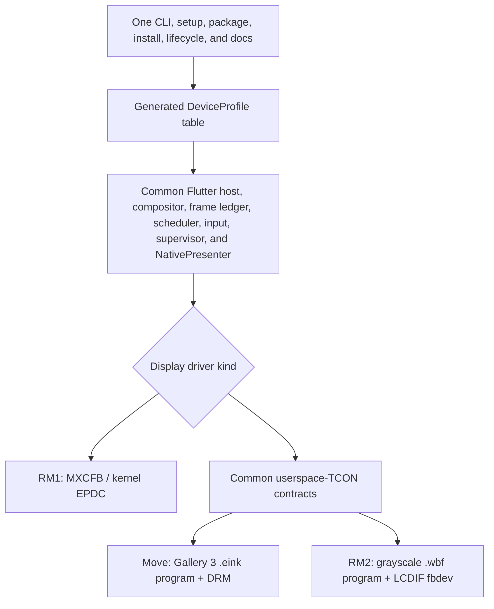

# Remove AppLoad: one native Pluto runtime for every supported reMarkable

Status: live implementation and acceptance plan for a pre-release hard
cutover. The source cut is implemented; the final clean-revision host,
artifact, three-device optical, lifecycle, recovery, and residue gates remain
open. This user-requested plan remains as the sole historical cutover inventory;
when Phase 7 and the Definition of Done are complete its status changes to a
completed record rather than becoming an active compatibility document.

This document plans the work required to make reMarkable 1, reMarkable 2, and
Paper Pro Move use one Pluto product path with device-aware native display
drivers. Sections describing the pre-cutover state are retained as the baseline
against which the final same-revision evidence is judged; current implementation
status lives in `native-cutover-report.md`.

The end state is deliberately uncompromising:

- Pluto has no AppLoad, XOVI, QTFB, cooperative-runtime, or stock-Xochitl
  rendering dependency.
- `pluto devices`, setup, build, provision, package, install, run, logs,
  screenshot, restore, and uninstall have one public flow on every device.
- Hardware identity is detected automatically. A user never selects a backend.
- Common lifecycle, rendering, scheduling, input, packaging, and recovery code
  is shared. Code branches only at the hardware interfaces that genuinely
  differ.
- Home, Counter, Motion Lab, Ink Lab, Validation Lab, and Ink are the common
  all-device acceptance set. Paper Codex remains only where the upstream CLI is
  already native (`linux-arm64`); Pluto does not build an ARMv7 port.
- There is no backward-compatibility reader, legacy alias, protocol
  negotiation, migration layer, deprecated command, or dual-backend release.
  Old development artifacts simply stop being valid.
- The existing cooperative implementation and all of its source, build tools,
  tests, docs, caches, payloads, sockets, and device residue are deleted after
  the native replacements pass the all-device gate.
- Unknown hardware, panel data, waveform data, or driver state fails closed
  before Pluto writes to the display.

Stock Xochitl remains the recovery target when Pluto is restored or uninstalled.
It is not a rendering backend or fallback inside a running Pluto session.

## 1. Decisions this plan makes

1. **One product, not three ports.** The CLI, app package, launcher, supervisor,
   session protocol, renderer, frame ledger, refresh scheduler, input pipeline,
   logging, and docs remain common.
2. **A small generated device-profile table is the only model routing source.**
   Scattered `if (rm1)`, geometry guesses, shell-script model lists, and Dart/C++
   copies of the same facts are not allowed.
3. **The presenter exposed to a device session is `native`.** The current
   device-facing `swtcon` name is renamed; no compatibility alias remains.
   `host` presenters may remain for development.
4. **Display-driver differences are explicit and narrow.** RM1 delegates
   waveform execution to the kernel EPDC driver. Move and RM2 execute waveform
   phases in userspace but use different waveform formats and scanout devices.
5. **CPU architecture is not a backend.** `linux-arm` and `linux-arm64` remain
   internal build targets. Both are native. The current coupling of
   `direct == linux-arm64` and `cooperative == linux-arm` is deleted.
6. **One package schema replaces the current schema in place.** It can carry one
   or both target slices, has no legacy reader, and is selected automatically
   after probing the device.
7. **Large waveform tables are generated, immutable, and memory-mappable.**
   Small hot tables are generated as `constexpr` data. Runtime parsing,
   decompression, allocation, and avoidable arithmetic are removed only where
   real-device measurements prove the generated form wins.
8. **AppLoad is removed in one cutover, not deprecated.** Native development can
   happen on an integration branch, but no release or documented mainline state
   ships both paths.
9. **App capability is declared without creating another product flow.** App
   manifests list their supported targets. The release/package commands build
   every declared slice, the launcher shows what is installed, and unsupported
   explicit builds fail before compilation. Paper Codex is `linux-arm64` only;
   its custom ARMv7 recipe, patches, pin, artifacts, materializer, cache, and
   device hooks are deleted.

## 2. Why one OS does not mean one display implementation

The devices share a Linux-based reMarkable environment and much of the same
userspace contract, which is why setup, lifecycle, apps, and the CLI should be
universal. Their panel-driving kernel interfaces are not the same:

| Device | CPU/target | Native display boundary | Native Pluto driver |
| --- | --- | --- | --- |
| reMarkable 1 (`zero-gravitas`) | ARMv7, single Cortex-A9 | `mxc_epdc_fb`; the kernel accepts rectangles, waveform modes, temperature, and update markers and executes the waveform | `MxcfbEpdcBackend` |
| reMarkable 2 (`zero-sugar`) | ARMv7, dual Cortex-A7 | `mxsfb`/LCDIF scanout; userspace must turn WBF transitions into phase buffers and pan them safely | `LcdifSwtconBackend` |
| Paper Pro Move (`chiappa`) | AArch64, dual Cortex-A55 | DRM scanout plus the Gallery 3 panel controller; Pluto already executes the `.eink` waveform path | renamed/generalized `Gallery3DrmBackend` |

The legacy 1404x1872 surface also contains about 1.62 times as many pixels as
Move's 954x1696 logical surface, while its ARMv7 cores are substantially older.
Removing AppLoad eliminates needless copies, queues, Qt painting, and synthetic
completion, but it cannot make those CPUs or pixel counts identical. Acceptance
therefore compares each device against itself and stock behavior; it does not
require RM1 or RM2 to match Move's absolute latency.

The correct unification boundary is consequently above the hardware driver, not
inside it:



## 3. Current-state facts to preserve as baselines

Record these again in machine-readable evidence before implementation; they are
an audit snapshot, not a permanent compatibility promise.

### 3.1 RM1

- Kernel `5.4.70-v1.6.3-rm10x`. The closest published official kernel source
  is reMarkable's `RM1XX_5.4.70_v1.6.2` commit
  `d54fe67bf86e918468b936f97a2ec39f4f87a3d9`; reMarkable has not published a
  byte-matching v1.6.3 ref, so the source gap is recorded rather than hidden.
- `/proc/fb` reports `mxc_epdc_fb` at `/dev/fb0`.
- Visible framebuffer is 1404x1872, virtual 1408x3840, RGB565, 2816-byte
  stride, current rotation 1.
- Panel firmware observed at
  `/lib/firmware/imx/epdc/epdc_ES103CS1.fw`; the observed unit's SHA-256 is
  `185515bebf37d3e9d99ffa1f13a2804bbb2b64464fa6fc5067475fb6f65ff6b0`.
- The official UAPI exposes waveform selection, automatic update mode, update
  scheme, temperature, update submission, marker completion, an explicit
  collision-test flag for dry-run probing, and power-down delay. Normal marker
  completion is not production collision telemetry.
- Xochitl currently owns the framebuffer, Wacom pen, Cypress touch device, and
  GPIO keys while the cooperative stack is active.

### 3.2 RM2

- Kernel family 5.4.70 with the official `zero-sugar` device tree.
- `/dev/fb0` is the LCDIF `mxsfb` path, not an EPDC update API.
- The stock runtime programs a narrow, tall phase-scanout framebuffer rather
  than exposing the 1404x1872 logical image directly.
- The audited unit actively selects
  `/var/lib/uboot/320_R405_AFA011_ED103TC2C5_VB3300-KCD_TC.wbf`, size 285,735
  bytes, SHA-256
  `79783d751ba066af12c6ac5aca46279fe7c79d4ef834105bd46824f870f9c6f8`,
  for panel signature `ED103TC2C5`. The R467/C6 file under `/usr/share` is a
  discovery candidate on this image, not an accepted fallback. The profile
  binds active source, exact digest, and panel/FPL signature together.
- The stock observer measured a 260x1408, 32-bpp `mxs-lcdif` mode with a
  1,040-byte stride, virtual height 23,936, and 17 phase slots of 1,464,320
  bytes each. The 24,893,440-byte slot footprint lives inside an exact
  33,554,432-byte framebuffer mapping; Pluto must map the kernel-reported
  allocation rather than the footprint. Observed stock pan cadence was 11.886
  ms median and 11.933 ms p95. The 11.763 ms profile candidate remains
  provisional until the native transport measures latch timing directly;
  reverse-engineered constants are not vendor guarantees.
- The official kernel's `prevent-frying-pan` path, blank/unblank sequencing,
  regulator control, current-frame completion, and final safe-hold buffer are
  safety requirements, not optional optimisations.

### 3.3 Move

- Move is the correctness and architecture reference, not a byte-for-byte
  template for legacy hardware.
- Its current direct path already provides the reusable compositor, frame
  ledger, scheduler, userspace waveform concepts, DRM completion, input, and
  supervisor behavior.
- Current Move-only constants, input paths, `.eink` path, DRM geometry,
  frontlight assumptions, power paths, and `swtcon` naming must be removed from
  common code and supplied by its profile/backend.

### 3.4 Existing performance evidence is not a device comparison

There is no valid synchronized, apples-to-apples RM1/RM2-versus-Move benchmark
today. The audit found that a full legacy RGB565 frame is 5,256,576 bytes and
the QTFB presenter copies damaged rows into both its screenshot mirror and
shared memory before Qt paints again. A full update therefore causes about
10.5 MB of explicit presenter copies before the Qt/Xochitl work.

On the audited RM1, AppLoad receipt to Qt paint entry was roughly 19.5 ms median
and 67.2 ms p95 in the sane samples. This excludes most Flutter work, downstream
Xochitl submission, waveform execution, and optical settling. Startup log
intervals likewise include Dart/layout/raster work and cannot be attributed to
AppLoad. These figures justify measurement and copy removal; they must not be
used as final speedup claims.

## 4. One generated device-profile source of truth

Add a hand-reviewed source file such as `config/device_profiles.json` and a
deterministic generator such as `tools/codegen/generate_device_profiles.dart`.
The generator emits, and CI checks for drift in:

- a C++ immutable table for the embedder;
- a Dart immutable table for the CLI and package builder;
- minimal POSIX-shell profile fragments for the BusyBox supervisor scripts;
- test fixtures for every accepted and rejected identity;
- the user-facing support matrix embedded in the compatibility docs.

Generated files are checked in only when the repository already needs them for
offline builds. Developers edit the source JSON, never the emitted copies.

Each profile contains only data that is actually device-specific:

- immutable identity predicates: reMarkable codename, machine/model strings,
  device-tree compatibles, SoC family, and CPU ABI;
- internal target slice: `linux-arm` or `linux-arm64`;
- logical panel dimensions, orientation, DPI, color/gray capabilities, and
  permitted pixel formats;
- display-driver kind and strict `fb_fix_screeninfo`, `fb_var_screeninfo`, DRM,
  scanout, stride, buffer-count, and alignment expectations;
- panel signature plus accepted waveform source digests and temperature paths;
- stable evdev identity/capability predicates and calibration matrices, never
  transient `/dev/input/eventN` numbers;
- power key, frontlight, regulator, temperature, suspend, and boot/recovery
  paths, with unsupported capabilities represented as absent;
- scheduler candidates such as worker count, affinity, and priority bounds;
- presenter capabilities such as refresh control, real completion, overlap
  behavior, color quantization, damage alignment, and handoff support.

Profiles have stable identity names such as `rm1`, `rm2`, and `move`; they do
not have compatibility or schema versions. Generated data carries fixed magic,
sizes, the profile identity, and cryptographic input digests so corrupt or
mismatched content can be rejected. A generator/runtime change lands atomically
and old output is not read.

Identity rules are conjunctive and fail closed. Geometry alone, an ARM ABI
alone, a common firmware build number, or the existence of `/dev/fb0` must never
route a device. The CLI selects a profile during read-only probing, and the
embedder independently revalidates the live identity and display interface
before the first write.

Model checks are forbidden outside:

1. generated profile selection;
2. the native display-driver factory;
3. backend modules whose hardware contract is named by the profile.

All higher layers branch on capabilities or interfaces, not `rm1`, `rm2`, or
`move` strings.

## 5. Common native runtime architecture

### 5.1 Rename and narrow the presenter contract

Expose one device presenter, internally called `native`. Rename the current
Move-specific `swtcon` registry entry, command flag, service reporting, and
backend directory/identifiers to `native` and `gallery3_drm`; do not retain a
command alias. Keep `swtcon` only where it accurately names the internal
userspace-TCON technique shared with RM2. The native presenter factory accepts
the already-validated `DeviceProfile` and constructs exactly one display
backend.

Define a common `NativeDisplayBackend` contract around behavior, not ioctls:

- `probe(profile)` validates hardware and returns measured display limits;
- `start()` acquires the display and establishes a known safe state;
- `submit(PresentJob)` takes durable ownership of an immutable job and returns
  a submission identity;
- `wait_idle()` represents real device completion, not an arbitrary timer;
- `snapshot()` reads the common settled/frame ledger rather than a second
  presenter-only full-frame mirror;
- `suspend()` drains and places hardware in its documented safe state;
- `resume()` reopens and revalidates every device object;
- `stop()` releases display ownership before stock handback;
- `health()` exposes timeouts, backend-supported overlap/phase faults, queue
  depth, and hardware faults to the supervisor.

`PresentJob` keeps the existing common concepts: frame ID, one or more exact
damage rectangles, immutable pixel source/lifetime, refresh class, urgency,
settled/truth intent, and optional handoff state. It must not contain AppLoad
wire concepts or backend-specific waveform numbers.

The presenter reports completion only when the backend's real completion point
is reached:

- RM1: the kernel confirms the submitted update marker;
- RM2: the final waveform phase is latched and the safe hold is armed;
- Move: the existing DRM/panel completion contract.

Synthetic QTFB fences and idle timers are deleted.

### 5.2 Keep common rendering and scheduling common

The following remain above the driver and must not be forked per model:

- Flutter engine hosting and AOT lifecycle;
- software compositor and pixel ownership;
- tile hashing/diffing and multi-rectangle damage;
- frame ledger, exact-content truth, preview/truth separation, and screenshots;
- refresh-class policy, overlap/debt policy, ghost maintenance, and warm handoff;
- input-to-Flutter event translation;
- launcher/app switcher/session protocol;
- logs, health, crash recovery, restore, and uninstall.

The scheduler consumes backend capability values. RM1 starts with overlap
supersession disabled until its controlled overlapping-update tests prove final
content ordering; normal MXCFB completion supplies no collision telemetry for
the scheduler. That does not require an RM1 scheduler fork. A backend that has
no frontlight simply exposes no frontlight capability; it does not need a
separate session script.

### 5.3 Share userspace-TCON concepts without conflating panels

Move and RM2 can share interfaces and tested algorithms for:

- settled/target/current panel-state planes;
- legal transition lookup and refresh-class program selection;
- temperature-bin selection and hysteresis;
- phase-job lifetime, cancellation, retargeting, and completion;
- scan worker queues, prefetching, buffer ownership, fault propagation, and
  timing telemetry.

They do not share raw table formats or scanout packing:

- Move uses Gallery 3 `.eink` programs, color state, controller rows, and DRM.
- RM2 uses grayscale `.wbf` transitions, two-bit drive codes, LCDIF row/control
  packing, and framebuffer pan/VSYNC behavior.

Express that split with small interfaces such as `WaveformProgram` and
`ScanoutTransport`, implemented by format- and hardware-specific modules. Do
not add a lowest-common-denominator switch inside every hot loop.

### 5.4 Generalize input, power, and session ownership

Replace Move-only defaults in `evdev`, `pluto-session.sh`, power-key handling,
frontlight snapshots, waveform paths, DRM paths, and boot confirmation with
generated profile data.

The common session sequence is:

1. revalidate profile and recovery readiness;
2. stop Xochitl and verify it released display and input descriptors;
3. acquire and validate the display backend;
4. discover/grab pen, touch, and keys by stable identity and capabilities;
5. start the common engine and supervisor;
6. on suspend or handback, drain display work, release evdev grabs, place the
   panel in a safe state, close display descriptors, then start stock services;
7. after resume, reopen and revalidate rather than reusing stale descriptors.

No AppLoad menu entry, external manifest, XOVI mount, QTFB socket, or injected
stock process participates.

## 6. RM1 native workstream: kernel EPDC/MXCFB

RM1 is the simpler native legacy path because the official kernel already owns
waveform generation and provides an update/completion UAPI. Do not port the
Move userspace waveform engine to RM1.

### 6.1 Implementation modules

Add a focused backend, for example:

- `embedder/src/presenter/native/mxcfb/mxcfb_uapi.h`: the exact pinned official
  UAPI subset with ARM32 size, offset, and enum assertions;
- `mxcfb_device.{h,cc}`: mockable `open`, `ioctl`, `mmap`, and close seam;
- `mxcfb_presenter.{h,cc}`: profile validation, damage copy, marker queue,
  completion worker, health, suspend, and resume;
- host tests and an ARM32 device benchmark.

On open:

1. open `/dev/fb0` read/write and close-on-exec;
2. query fixed and variable framebuffer information;
3. reject the device unless driver ID, geometry, bpp, stride, rotation, memory
   bounds, kernel identity, and profile all agree;
4. map `smem_len`, never `width * height * bytes_per_pixel`;
5. apply the exact accepted waveform-mode map, region automatic-update mode,
   and snapshot update scheme;
6. fill the mapped surface with the accepted safe initial content;
7. explicitly issue `FBIOBLANK(FB_BLANK_UNBLANK)` and verify the EPDC is ready;
8. submit and wait for one known-state full update before accepting app jobs.

First characterize the exact initialization that the stock cold-boot path
requires: mode state, waveform map, blank state, EPDC readiness, and the safe
initial update. Test the sequence from a tethered cold boot where Xochitl has
never opened/configured `/dev/fb0`, not only after stopping an already-running
Xochitl. The backend must not assume stock userspace performed hidden
initialization, and it must not send an update while the driver remains blanked.

Snapshot mode is required for the correctness implementation because the Pluto
presenter contract makes source pixels durable when `submit` returns. A deferred
queue-and-merge mode can read a framebuffer region after later writes have
changed it. Benchmark it during Phase 6, then either prove its frame lifetime
and select it or delete the experiment before cutover.

For each job:

- convert/copy only exact damaged rows into the mapped RGB565 framebuffer while
  respecting the 2816-byte stride and right-edge padding;
- allocate a unique nonzero 32-bit update marker;
- submit the exact rectangle, mapped waveform, temperature policy, and
  partial/full mode with `MXCFB_SEND_UPDATE`;
- map marker to Pluto frame ID in a bounded queue;
- have one completion worker call `MXCFB_WAIT_FOR_UPDATE_COMPLETE` and report
  completion to the common scheduler;
- surface timeouts and driver errors; a five-second kernel completion timeout
  is device loss, not a successful synthetic completion. Use
  `EPDC_FLAG_TEST_COLLISION` only in explicit bring-up/dry-run tooling; never
  treat its result as normal-update scheduler telemetry.

Initial conservative capabilities are RGB565, pre-dithered input, real
completion, refresh-class control, damage alignment from measured driver
requirements, no overlap supersession, and a small bounded in-flight count.
Increase concurrency only after overlapping-update and newest-content tests
prove final ordering without relying on collision callbacks.

Do not use the alternate-buffer ioctl path in the correctness implementation.
Evaluate the virtual pages as a Phase 6 zero-copy/ring candidate only after
marker correctness is established; select one proven path and delete the other
experiment before cutover.

### 6.2 Resolve waveform-class mapping empirically

Do not infer the final class table from generic names or another firmware.

Before removing the existing lab integration, use a tethered, forwarding ioctl
observer or an equivalently controlled stock test to capture the exact
`MXCFB_SEND_UPDATE` structures Xochitl uses for known actions. The observer is
research tooling and is deleted before cutover.

For the exact accepted EPDC firmware and at several temperatures:

1. exercise black/white, 16-gray ramp, text, scroll, pen, erasure, and full
   cleanup fixtures;
2. census the waveform and temperature tables where the format permits;
3. measure candidate modes for optical onset, completion, flash, gray fidelity,
   and residual ghosting;
4. pin Fast, UI, Text, and Full mappings only after the camera results agree
   with the submitted/completed marker trace;
5. begin with ambient kernel temperature handling and retain the kernel/PMIC
   path unless measurements prove a better safe policy.

Likely candidates such as DU for Fast and GC16 for Full are hypotheses, not
production constants.

### 6.3 RM1 lifecycle and acceptance

- Supply pen, touch, and GPIO-key predicates from the RM1 profile; read axis
  ranges dynamically with evdev ioctls and apply the generated transform.
- Make frontlight behavior absent rather than adding RM1-only shell flow.
- Drain update markers before suspend; use the existing firmware suspend target
  only after validating it on the exact image.
- Preserve peer-root/boot-count recovery. Confirm the exact partition topology
  before reusing Move paths.
- Keep boot-default disabled until tethered display, input, crash, suspend,
  restore, and optical tests pass.

The RM1 gate requires real marker completion for every accepted frame, no stale
replay under overlapping updates, correct edge/rotation/stride behavior, pen
and touch calibration, twenty suspend/wake cycles, repeated app switches, a
forced timeout recovery, camera-visible improvement over its own QTFB baseline,
and stock restoration after reboot.

## 7. RM2 native workstream: WBF plus LCDIF

RM2 is the critical-risk workstream. Its kernel supplies scanout and safe power
sequencing, but userspace must generate the e-ink drive phases. Pluto must not
remove AppLoad or enable boot-default on RM2 until the standalone generator is
byte-accurate, optically accepted, and fails safe.

### 7.1 Clean-room and source boundary

Use the official reMarkable kernel as the authoritative ABI and safety source.
Use the MIT-licensed `yobert/swtcon` project as a differential oracle, not a
runtime dependency. `timower/rM2-stuff` is GPL-3.0 and is research evidence
only unless a deliberate legal decision changes how code is incorporated. Do
not copy GPL implementation into Pluto.

The existing `rM2-stuff` path also relies on Xochitl generator addresses. It
proves aspects of WBF and scanout behavior, not that it is a standalone backend
we can ship.

Before implementation, write a short provenance record for each production
module: official ABI/spec evidence, independently captured fixtures, any MIT
reference used, author, and review signoff.

### 7.2 Freeze a strict RM2 hardware profile

Read-only probing records and validates:

- zero-sugar identity, ARMv7 ABI, kernel and device-tree identity;
- framebuffer fixed/variable fields after the stock mode is configured;
- exact phase-buffer dimensions, format, stride, count, timing, pan semantics,
  and safe-hold slot;
- EPD serial/FPL lot, WBF path, SHA-256, embedded panel signature, and mode/temp
  directories;
- SY7636A temperature, VCOM, power-good, regulator state, and permitted bounds;
- orientation and logical-to-scan transform.

An arbitrary WBF fallback is forbidden. Unknown panel lot, hash, control layout,
temperature state, or framebuffer mode aborts before rails or scanout are
changed.

### 7.3 Build an observer and byte-exact oracle corpus

While stock Xochitl still works, capture immutable fixtures for:

- initialisation, white, black, checkerboard, 16-gray ramp, text, pen strokes,
  and erasure;
- full and partial DU, fast grayscale, full-quality, cleanup, and any supported
  ghost-maintenance sequence;
- multiple temperature bins and boundary transitions;
- full phase buffers, pan order/timestamps, control bits, dummy rows, safe-hold
  rearming, input old/new state, and final panel state.

Derive, then independently review, drive-code polarity, row packing,
rotate/invert mapping, control-word templates, partial-window behavior, legal
retargeting, and when settled state advances. Store small redistributable test
fixtures in the repository and hashes/manifests for any vendor-owned captures
that must stay outside it.

This oracle tooling is not a second production backend. Remove its injection,
address, and Xochitl-specific components during the hard cut.

### 7.4 Implementation modules

Add focused modules behind the common native interfaces:

- `WbfDecoder`: bounded/endian-safe directory, temperature, RLE, mode, and
  transition decoding with no arbitrary fallback;
- `Rm2WaveformProgram`: explicit mode/temp/phase and old-state/new-state to
  two-bit drive sequences;
- the common userspace panel-state engine, specialized only where RM2 transition
  semantics require it;
- `Rm2ScanEncoder`: logical rotation/inversion, drive packing, dummy rows, and
  immutable control templates;
- `MxsLcdifDevice`: mode validation, bounded mapping, slot ownership,
  pan/current-frame completion, VSYNC, blank/unblank, temperature/power-good,
  bounded post-blank rail-settle observation, and fault handling through kernel
  APIs;
- `Rm2ScanLoop`: never overwrites an in-flight slot, advances one phase exactly
  once, rearms the safe hold, and turns any missed deadline or hardware fault
  into a supervisor-visible fatal error;
- `LcdifSwtconBackend`: maps common refresh classes to accepted WBF programs and
  reports completion only after the last phase is latched.

Never use `/dev/mem`, hard-coded Xochitl addresses, raw GPIO, or direct I2C/PMIC
writes. Use framebuffer, regulator, thermal, and sysfs/kernel interfaces whose
behavior is validated against the official kernel.

The official `zero-sugar` driver reads SY7636A `state` and `power_good`
independently from the same register. Pluto therefore brackets each diagnostic
state read with live power-good reads. Powered work requires both samples to be
valid, equal, and `ON`; a torn sample, unknown state, unreadable attribute, or
power loss fails closed. Known state strings are telemetry and may change
without creating a second lifecycle flow or restarting a healthy app. The
same check encloses temperature access, cold INIT, and every phase drive.

### 7.5 Bring-up ladder

Each rung must pass and produce evidence before the next is attempted:

1. host-only WBF parser fuzzing, goldens, generated-pack validation, and
   scalar/SIMD byte parity;
2. read-only stock observer with no display writes;
3. persistent SSH, dead-man recovery, untouched stock peer root, boot counter,
   and tested restore path;
4. issue framebuffer powerdown, wait within a fixed bound for live power-good
   to fall, then while blanked and rails safe program the exact framebuffer
   mode with all slots containing the byte-exact safe hold;
5. validate power-good, temperature, VCOM, profile, pan completion, and safe-hold
   rearming without an active waveform;
6. one initialisation sequence, then white, black, restore, and optical check;
7. full-quality static fixtures;
8. tiny partial rectangles and edges;
9. refresh classes, overlapping jobs, retargeting, and ghost maintenance;
10. pen/touch, app switching, suspend/resume, crash, reboot, and boot-default.

Timeout, power-good drop, invalid temperature, regulator fault, underflow,
missed pan/phase, signal, or process crash must blank safely and transfer to the
tested stock recovery path. Never repeat an active drive phase after uncertain
completion.

### 7.6 RM2 acceptance gate

- Parser: malformed length, endian, directory, RLE, mode, transition, and
  temperature inputs are fuzzed and fail closed.
- Oracle: generated phase bytes and pan order are exact for fixed fixtures
  across accepted modes and temperature bins.
- Scanout: the measured mode, slot count, phase interval, and safe-hold behavior
  match the accepted profile; there are zero underflows, timeouts, or overwritten
  in-flight buffers.
- Optical: black/white, 16-gray, text, pen, scroll, partial/full, and 10,000-job
  soak are no worse than stock for contrast, cast, ghosting, or final content at
  the same WBF/mode/temperature.
- Lifecycle: twenty suspend/wake cycles, repeated app switches, crash recovery,
  reboot, boot-loop fallback, restore, and uninstall succeed.
- Performance: encoder p50/p95/p99, CPU, RSS, temperature, queue depth,
  input-to-glass onset, and settle are captured; encoder p99 remains well below
  the measured phase interval with zero missed phases.

If standalone generation cannot meet byte-exact and optical gates, RM2 remains
unsupported in that integration branch. AppLoad is not reintroduced as a
fallback.

## 8. One setup, build, package, install, and documentation flow

The public commands remain the same for all three devices:

```bash
./tools/setup/setup.sh

DEVICE=root@10.11.99.1
pluto devices --device "$DEVICE" --probe
pluto provision --device "$DEVICE"
pluto provision --device "$DEVICE" --status

cd apps/examples/counter
pluto build package --device "$DEVICE" --release
pluto install --device "$DEVICE" --release --force build/pluto/app.plap
pluto run --device "$DEVICE" --release dev.pluto.examples.counter
pluto logs --device "$DEVICE"
pluto screenshot --device "$DEVICE" -o shot.png
```

There is no RM1 guide, RM2 setup mode, Move installer, backend prompt, XOVI
prerequisite, or AppLoad menu action.

### 8.1 Split profile, target, and driver internally

Replace the current backend/target coupling with three internal facts:

- `DeviceProfile`: exact supported hardware identity;
- `TargetSlice`: `linux-arm` or `linux-arm64`;
- `DisplayDriverKind`: MXCFB EPDC, LCDIF userspace TCON, or Gallery 3 DRM.

`pluto devices --probe` determines all three read-only. Build/provision selects
the target slice; the installed native runtime selects and revalidates the
display driver from the profile. No command accepts a display-driver override.
Keep `PlutoTargetPlatform.linuxArm` and its ARM32 validation; derive it from the
profile target instead of a cooperative-backend enum.

Release AOT remains the universal normal flow. If ARMv7 debug/profile engines
are not provided, explicit debug/profile commands fail during capability
validation before packaging or device writes. That is a capability difference,
not a second installation flow and not a reason to retain AppLoad.

### 8.2 Replace the package layout directly

Hard-replace the current `.plap` layout with one canonical archive schema. A
package contains the common manifest and one or more target slices under fixed
paths such as:

```text
manifest.json
targets/
  linux-arm/
    bundle/...
    build-metadata.json
  linux-arm64/
    bundle/...
    build-metadata.json
```

The exact archive naming can follow the existing package conventions, but the
rules are fixed:

- a device-aware local build emits one selected slice;
- a published release build emits both slices as one distributable artifact;
- install uses the probed target automatically and rejects a missing or
  contradictory slice;
- every slice passes the existing release-AOT, engine-pin, ELF ABI, and product
  metadata gates;
- one app identity and manifest are shared across slices;
- the parser has no format-version switch and does not recognize old layouts;
- remove old package fixtures and tests instead of teaching the new reader to
  migrate them.

### 8.3 Replace two payload assemblers with one release assembler

Create one public release assembly entry point, for example
`tools/build/assemble-device-release.sh`, producing a release set such as:

```text
build/pluto-release/
  release-manifest.json
  targets/linux-arm/root/home/root/pluto/...
  targets/linux-arm64/root/home/root/pluto/...
```

It invokes architecture-specific private workers because ARMv7 and AArch64 need
different compilers and engine artifacts. That unavoidable build detail is not
exposed as a product flow.

Keep and refactor the following because native RM1/RM2 still require them:

- the ARMv7 CMake toolchain and `device-arm` preset;
- `tools/build/embedder-device-arm.sh` and its container worker, either as
  private workers or renamed consistently;
- the committed `linux-arm-release` Flutter engine payload;
- ARM32 ELF, hard-float, system-library ceiling, and release-AOT verification.

They are not AppLoad artifacts. Delete their AppLoad/QTFB assumptions and feed
their outputs into the common release assembler.

Do not port Codex to ARMv7. Upstream Codex has no native ARMv7 release, so
delete Pluto's custom ARMv7 source recipe, patches, pin, split artifacts,
materializer, cache, packaging/provisioning hooks, tests, and documentation.
Keep the existing Paper Codex app only for `linux-arm64`. App manifests declare
target availability, the standard `linux-arm` slice omits Paper Codex, and an
explicit ARM build request fails before invoking Flutter or writing a device.

Delete `assemble-appload-arm-payload.sh`; do not rename its integration-heavy
layout and keep it alive. The common assembler builds a native ARM payload from
the same session, supervisor, recovery, launcher, apps, and manifest sources as
the AArch64 payload.

Use `/home/root/pluto` and common service/socket names on every target. The old
cooperative `/home/root/pluto-arm`, external manifests, and menu entries do not
survive.

### 8.4 Make setup universal

`tools/setup/setup.sh` and `--verify` become the only host setup path. They:

- validate both committed engine target slices offline;
- validate both native embedder toolchains and ELF gates;
- build/verify the profile and generated-data tools;
- verify generated outputs have no drift;
- install one `pluto` CLI;
- never fetch or build XOVI, AppLoad, QRR, or an injection patch.

Waveform assets are handled inside the same provision command. If redistribution
is allowed, accepted generated packs can be pinned with the release. Otherwise,
provision reads the device-owned `.eink` or `.wbf` asset over the existing SSH
connection, verifies its panel identity/digest, generates the deterministic pack
in the local cache, and installs it transactionally. The user does not run a
waveform command.

### 8.5 Generalize the direct provisioner

Refactor the existing Move boot-first/direct provisioner rather than creating
RM1 and RM2 provision scripts. The common provision transaction:

1. probes and validates the profile and target;
2. selects the matching release slice;
3. validates all hashes, engine pins, executable ABIs, generated profile data,
   and waveform pack identity;
4. checks the exact device's stock recovery/peer-root topology;
5. stages `/home/root/pluto` and common service integration;
6. installs the same dead-man, boot-count, and stable-window safeguards;
7. activates the native session only after all preflight checks pass;
8. verifies process identity, presenter/profile identity, display ownership,
   and a fresh frame;
9. confirms boot-default only after the profile-specific hardware smoke passes.

The transaction rolls back its own current attempt on failure for safety. It
does not read or migrate a cooperative installation, old package, old protocol,
or old runtime root.

`--restore-remarkable` and `--uninstall` share the same implementation on every
device: stop Pluto, release native hardware, remove Pluto's stock-service
override and runtime, restore/start stock Xochitl, verify it optically, and
leave no Pluto service running.

### 8.6 Rename the shared control client before deletion

`tools/device/pluto-apploadctl.c` is misleadingly named but is not wholly
AppLoad-specific: the direct Move screenshot/control path currently uses it to
talk to `/run/pluto/embedder-control.sock`.

Before deleting the old file:

1. extract only the generic embedder control protocol;
2. rename the source and binary to `pluto-controlctl`;
3. require an explicit `--socket` or a single embedder-control socket constant;
4. remove the AppLoad socket default, AppLoad actions, fallbacks, and protocol
   documentation;
5. update both target builds, payload assembly, provision command, device
   operations, screenshot/log controls, and tests;
6. deploy it on Move and prove screenshot/control still work;
7. then delete `pluto-apploadctl` with no alias or wrapper.

### 8.7 Keep the active docs singular

Rewrite README, AGENTS, Getting Started, compatibility, AOT, lifecycle, build,
device, pen, ghost-control, optimisation, and camera docs around the commands
above. The compatibility page describes native driver internals in a maintainer
table, but user instructions never fork by backend.

Delete injection/AppLoad/XOVI architecture material rather than marking it
legacy. Durable driver details go into a native display architecture document
whose language does not preserve the obsolete product path.

## 9. Performance and generated-data programme

Performance work begins before removal so it has a valid cooperative baseline,
then continues on the native path. Every claimed improvement is measured on the
exact target device and with optical evidence where panel latency is involved.

### 9.1 Build a comparable benchmark corpus

For RM1, RM2, and Move, use the same release-AOT commit, content, damage, refresh
intent, warmup, power state, and measurement protocol. Run at least 30 measured
iterations per case and record p50, p95, p99, minimum, maximum, and failures.

Include both normalized work and real UX:

- 96x96, 512x512, and one-million-pixel updates;
- one tile, sparse separated rectangles, a large bounding rectangle, and full
  screen;
- black/white, gray ramps, text, launcher grid/list, scroll, and animation;
- Ink preview plus exact truth, erasure, and eight nearby truth updates;
- Fast, UI, Text, Full, Blink, and Bleach where supported;
- cold launch, warm app switch, standby/resume, and stock restore;
- low, normal, and high safe temperature bins.

Capture exact model/profile, kernel, Flutter/engine pins, binary hashes, panel
signature, waveform digest, governor/frequency, temperature, load, RSS, damage
rectangles/pixels/bytes, refresh class, and final frame hash.

### 9.2 Carry one timing identity from input to glass

Use a fixed-size, allocation-free trace ring and one monotonic job ID across:

1. evdev receipt;
2. Flutter event injection;
3. Dart build/layout/raster milestones;
4. Flutter surface callback;
5. diff, classify, color conversion, and waveform lookup;
6. presenter admission and device submission;
7. backend-specific queue/phase/marker progress;
8. real hardware completion;
9. synchronized camera first visible change and settled image.

For the cooperative baseline only, additionally timestamp QTFB copy/send,
AppLoad receive, Qt dispatch/paint, and Xochitl submission where observable.
Do not keep that instrumentation in the final product.

Emit out-of-band summaries after a run; per-frame journald logging must not
perturb the measurement. Use the existing Ink Probe, compositor counters,
startup milestones, and Move presenter timing ring as inputs, then normalize
their output schema.

Camera capture must include a synchronized visual or LED marker and enough frame
rate to resolve first-change and settle. Logs alone do not establish visible
latency, ghosting, or correct final glass state.

### 9.3 Measure CPU and memory, not just wall time

For each case capture when available:

- cycles, instructions, IPC, cache/TLB misses, branch misses, context switches,
  migrations, faults, and CPU time by worker;
- bytes read/written/copied, damage amplification, scan buffers generated, and
  memory bandwidth estimates;
- allocations after warmup, peak/steady RSS, mapped pack size, and queue depth;
- frequency, thermal state, regulator/display faults, dropped/missed phases,
  completion timeouts, and optical failures.

Host benchmarks select candidates; ARMv7 Cortex-A9, ARMv7 Cortex-A7, and
AArch64 Cortex-A55 device results decide what ships.

### 9.4 Generate small hot LUTs as code

Use the device-profile/codegen pipeline to evaluate and, when faster, emit
aligned immutable tables for:

- RGB565 to grayscale/panel-level conversion: a complete 65,536-entry byte LUT
  is only 64 KiB and is a strong RM1 candidate;
- XRGB8888 channel-contribution LUTs: three 256-entry tables are preferable to
  a cache-hostile 16-million-entry RGB table;
- legal old-state/new-state transition IDs and target normalization;
- temperature threshold/bin selection and hysteresis;
- refresh-class to accepted waveform/program mapping;
- dither, quantization, gamma, and panel-level maps where a profile requires
  them;
- logical-to-scan coordinate transforms, lane masks, edge masks, pan offsets,
  and immutable control-row templates;
- Move CT33/color-front-end tables that are currently recomputed or parsed.

Each candidate is benchmarked against arithmetic, SIMD, and smaller/compressed
alternatives on all relevant CPUs. A table is rejected if cache pressure makes
real workload p95/p99 worse, even if its microbenchmark is faster.

### 9.5 Generate large waveform packs as binary data

Do not put every waveform phase in a giant C++ header. Add one deterministic
waveform compiler with format-specific decoders and a common validated envelope:

- input: exact source `.eink` or `.wbf`, profile identity, panel signature, and
  accepted source digest;
- output: an immutable, aligned, memory-mappable pack with fixed magic, bounds,
  input digests, and no compatibility version;
- content: only supported modes and temperature bins, phase offsets/counts,
  legal transitions, target maps, non-hold/impulse summaries, and format-specific
  scan data;
- layout: structure-of-arrays where hot lookup benefits, 64-byte alignment,
  deduplicated identical sequences, and no pointer fixups;
- runtime: validate once, `mmap`, pre-fault the hot index, and perform bounded
  lookups without RLE/deobfuscation, heap allocation, vector growth, or an LRU
  expansion cache in the presentation loop.

For RM2, compare dense `(mode,temp,phase,old,new)` drive tables with a compact
transition-to-sequence index; select by measured cache/memory cost. For Move,
pre-expand only programs the profile permits and remove current runtime
deobfuscation/decompression where the generated pack is demonstrably better.

Generated output must be reproducible byte-for-byte. CI regenerates it, compares
digests, fuzzes both source decoders, corrupts every header/offset class, and
verifies that mismatched panel/profile/source hashes fail before display writes.

### 9.6 Make ARMv7 SIMD a first-class target

Audit every hot kernel currently gated by both `__ARM_NEON` and `__aarch64__`.
The ARMv7 build already enables NEON, but those gates can force RM1/RM2 through
scalar renderer, conversion, sweep, deposit, and phase-pack paths.

For kernels that dominate device profiles:

1. create bit-exact scalar golden tests over exhaustive small states and random
   frames;
2. add 32-bit ARM NEON implementations with no unaligned/aliasing assumptions;
3. cross-build and run on both Cortex-A9 and Cortex-A7;
4. compare scalar, NEON, and LUT/NEON hybrids using real damage distributions;
5. ship one ARMv7 implementation when possible; add microarchitecture dispatch
   only if measured p95/p99 justifies its maintenance cost;
6. delete losing experimental paths from production code.

Existing real-device pen-truth batching achieved about 8x fewer waveform
operations and roughly 7.96x p95 improvement in its measured same-tile case.
Preserve that batching above all three backends and use the same
operation-reduction mindset before low-level tuning.

### 9.7 Remove copies and scheduling overhead

The native cut removes the QTFB shared-memory copy, screenshot-mirror copy,
socket send, Qt queued dispatch, QQuickPaintedItem/QPainter blit, bounding-box
damage amplification, and per-update AppLoad logging.

Then enforce:

- the common frame ledger is the screenshot source; no second full-frame mirror;
- sparse rectangles stay sparse unless a measured backend limit requires a
  merge;
- a small `Full`-quality rectangle does not automatically become a full-screen
  update;
- RM1 performs at most the required damage conversion/copy into its mapped
  framebuffer;
- RM2 writes the selected phase slot directly and never copies a completed full
  phase buffer merely to hand it to LCDIF;
- hot queues are bounded, preallocated, and allocation-free after start;
- waveform packs and scan buffers are mapped/prefaulted before first input;
- verbose per-frame logging is disabled outside trace builds;
- RM2 tests scan-worker affinity on the second Cortex-A7; RM1's single core uses
  conservative priority so Flutter/input/kernel completion cannot starve;
- real completion, not polling with zero-timeout socket calls, drives admission.

### 9.8 Performance acceptance

The performance gate is intentionally outcome-based:

- native RM1 and RM2 beat their own cooperative baselines for input-to-first
  visible change and settled response in the representative corpus, with no
  regression in final image, gray fidelity, ghosting, or reliability;
- Move has no statistically meaningful p95/p99 regression in existing renderer,
  pen, warm-handoff, ghost-control, or optical gates after generalization;
- sparse updates perform no full-frame intermediate copies and report damage
  amplification explicitly;
- there are no steady-state heap allocations in present/phase hot paths;
- every backend reports real completion or a fail-closed error;
- RM2 phase encoder p99 is at most 70% of the re-measured phase interval and a
  10,000-job soak has zero missed phases/underflows;
- every LUT/pack has an on-device before/after table; unmeasured generated data
  does not ship merely because it looks faster;
- every cross-app transition is camera-checked immediately after presentation;
  a later ghost-maintenance cycle cannot make an earlier retained-app image pass;
- final reports separate Flutter/raster, native CPU, driver/scanout, waveform,
  first optical change, and optical settle. No blended startup number is called
  rendering latency.

## 10. Hard-removal inventory

This is deletion, not deprecation. Execute it only after RM1, RM2, and Move pass
the native acceptance matrix, then land it as part of the same pre-release
cutover. Coordinate first with any parallel edits in these paths; do not discard
unrelated work.

### 10.1 Delete tracked cooperative implementation

Delete entirely:

- `embedder/src/presenter/qtfb/`;
- `embedder/src/engine/qtfb_input_bridge.cc` and `.h`;
- `embedder/test/presenter/qtfb_presenter_test.cc`;
- `embedder/test/engine/qtfb_input_bridge_test.cc`;
- `tools/integration/`, including source locks, GPL integration license, AppLoad
  patches, performance patch, build script, and integration tests;
- `tools/device/diagnostics/qtfb/`;
- `tools/device/appload-control-protocol.md`;
- `tools/device/provision-xovi.sh`;
- `tools/device/provision-pluto.sh`, after extracting any still-useful generic
  safety primitive into the common direct provisioner;
- `tools/build/assemble-appload-arm-payload.sh`;
- `tools/build/test/assemble-appload-arm-payload-test.sh`;
- `docs/remarkable-ui-injection.md` rather than preserving an obsolete
  injection architecture as active documentation;
- the old `tools/device/pluto-apploadctl.c` only after `pluto-controlctl` is live
  and verified on Move.

Remove the matching `.gitignore` entries and any orphaned licenses that apply
only to deleted third-party code. If any external implementation is actually
incorporated into the new backend, add its applicable attribution deliberately;
do not retain the entire old integration tree as accidental provenance.

### 10.2 Delete cooperative symbols and routing from remaining files

Remove, rather than leave unreachable:

- QTFB sources/tests from `embedder/CMakeLists.txt`;
- QTFB registry includes, names, auto-probes, environment keys, wire structs,
  client, input thread/translators, and EngineHost state;
- QTFB-specific presenter/channel reporting and comments;
- `PlutoRuntimeBackend.cooperative` and the backend enum entirely; every
  supported profile is native and carries a display-driver kind;
- `xoviAvailable`, `appLoadAvailable`, their device probes, doctor output, and
  JSON fields;
- cooperative firmware tables, AppLoad/XOVI roots, source digests, activation
  ledgers, staging, authorisation, restart, recovery, install, launch, logs,
  screenshot, and uninstall methods in `device_operations.dart`;
- every cooperative branch in build, package, provision, devices, doctor,
  install, run, logs, screenshot, restore, and uninstall;
- AppLoad external-manifest/menu-entry generation and control actions;
- `LauncherBackendMode` entirely, `SessionInfo.backendMode`, the
  service-channel and `packages/pluto_provision` backend-mode field, all
  decoding/UI instructions, fakes, and tests. Presenter/profile identity belongs
  in developer diagnostics and health logs, not a product-flow enum;
- `--remove-xovi`, XOVI/stock fallback modes, QTFB socket cleanup, and AppLoad
  wording from the boot, guard, session, and uninstall scripts;
- integration/AppLoad/QTFB tests from `ci/check.sh`.

Preserve generic renderer capability tests when they still describe a real
native or host-presenter behavior. Rename their fixtures/comments; do not delete
useful tests merely because QTFB was the first backend to exercise a capability.

### 10.3 Hard-replace formats and tests

- Replace old `.plap` reader/builder fixtures with the canonical target-slice
  schema. Do not retain an old-format parser or conversion test.
- Replace separate direct/cooperative payload manifests with the one release-set
  manifest. Delete cooperative payload markers and test fixtures.
- Remove CLI flags, JSON fields, help text, error remediation, and golden output
  that expose AppLoad/XOVI/QTFB/backend selection.
- Change old ARM tests from "ARM implies cooperative" to "ARM selects a native
  profile/driver"; retain all ABI and AOT checks.
- Replace shell-contract fixtures with the common native session/provision paths.
- Delete historical social/blog claims that describe AppLoad as current, or
  rewrite them around the native architecture if they are still intended to be
  published. Do not add a legacy note.

### 10.4 Artifacts and tools that must remain

Do **not** delete the following merely because the cooperative path used them:

- `linux-arm` target support;
- the ARMv7 engine payload and checksum manifest;
- the ARMv7 CMake toolchain, build container, ELF validation, and native preset;
- generic renderer capabilities such as backend color quantization, completion
  reporting, overlap semantics, and refresh control;
- responsive 1404x1872 layouts and their generic tests;
- RM1/RM2 identity recognition in the generated supported-profile table;
- `tools/pluto/pins/supported_os.json` entries still accepted by any native
  profile. Regenerate model/build acceptance from profile facts; never delete a
  shared firmware build merely because it also appeared in an integration
  fixture;
- stock Xochitl recovery and restore/uninstall behavior;
- the generic embedder control functionality extracted as `pluto-controlctl`.

Native RM1/RM2 depend on ARMv7. Removing these would defeat the goal rather than
remove AppLoad.

The custom ARMv7 Codex port is deliberately excluded from this preservation
list. Paper Codex and its existing native CLI integration remain an
`linux-arm64` capability only; the common product flow handles that single app
availability difference without a second installer, setup path, or runtime.

### 10.5 Purge ignored host/build residue

After the source cutover, remove local outputs that a clean build no longer
creates:

- `build/pluto-appload-arm/` and related archives;
- old `embedder/build/device-arm/` products built with QTFB, then rebuild the
  directory with the native ARM presenter;
- old `pluto-apploadctl` binaries in every build/payload directory;
- `.pluto-cache/xovi/`;
- `.pluto-cache/src/rm-appload-*`;
- `.pluto-cache/src/xovi-*`;
- `.pluto-cache/src/rm-xovi-extensions-*`;
- `.pluto-cache/build/appload-*`;
- AppLoad/QTFB/XOVI staging, probe, evidence, shared-memory hash-table, and
  integration source caches;
- ignored `analysis/reference/qtfb`, `analysis/reference/rm-appload`, and
  `analysis/reference/xovi` copies after the independent native fixtures and
  required provenance have been recorded;
- obsolete AppLoad/XOVI container images and volumes, after confirming they are
  not the generic ARMv7 compiler image.

This is a one-time developer cleanup, not a compatibility cleanup command that
ships in Pluto.

### 10.6 Clean lab devices before deleting the old recovery code

Because Pluto has not shipped, clean every lab RM1/RM2 while the current tools
still know how to reverse their own development installation:

1. confirm the acceptance device's entire XOVI/AppLoad installation is
   Pluto-owned, or obtain explicit owner authorization to remove it. A device
   with unapproved user-owned integration is excluded from the destructive
   cleanup and zero-residue device gate;
2. run the existing stock restore and full uninstall path;
3. verify stock Xochitl boots and paints optically;
4. remove Pluto-owned `/home/root/xovi`, `/home/root/pluto-arm`, AppLoad Pluto
   entries, external manifests, integration source/cache, and old binaries;
5. remove `/run/pluto/appload-control.sock`, `/tmp/qtfb.sock`, `/dev/shm/qtfb_*`,
   and the old `pluto-apploadctl` when no process owns them;
6. remove `/home/root/.pluto-xochitl-restart-ledger`,
   `/home/root/.pluto-xovi-stage-*`, `/home/root/.pluto-xovi-backup-*`,
   `/home/root/xovi/rollback/pluto-previous`,
   `/run/pluto/integration-provision.lock`, and
   `/home/root/xovi/exthome/qt-resource-rebuilder/hashtab`;
7. verify no XOVI/AppLoad mount, service link, or systemd drop-in installed by
   Pluto remains;
8. reboot and verify the stock sidebar has no AppLoad item;
9. only then delete the old cleanup/provision code from the repository.

Respect the Xochitl service restart limit: reset failed state before an approved
restart, batch experiments, keep at least three minutes between stop/start
cycles, and keep dead-man recovery armed.

The final product has no stale-install detector or migrator. An unexpected old
development device must be restored from the old development checkout or stock
recovery before using the new Pluto; the new provisioner does not recognize or
upgrade it.

### 10.7 Zero-residue gate

After the cutover:

- tracked source/build/docs contain no case-insensitive `appload`, `xovi`,
  `qtfb`, `cooperative`, old socket/root, or old control-binary references;
- `git ls-files` contains none of the deleted paths;
- CMake, setup, CI, assemblers, package fixtures, and payload manifests have no
  dormant cooperative inputs;
- built host/ARM/AArch64 binaries and `strings` output contain no cooperative
  registry names, paths, or UI instructions;
- assembled target slices contain no external manifest, injection patch,
  AppLoad/XOVI service, QTFB socket/client, or cooperative metadata;
- processes, mounts, services, sockets, shared memory, runtime roots, and stock
  sidebar on every lab device contain no Pluto-owned cooperative residue;
- a clean clone with an empty `.pluto-cache` completes setup, both target builds,
  release assembly, package/install, and the full gate without fetching any
  cooperative source.

This planning file itself contains the forbidden historical names. At final
completion, move durable architectural material into the native display docs
and delete `docs/remove-appload.md`; Git history is the record. The final tree
therefore needs no grep exception for this plan.

## 11. Execution plan and landing order

Develop on one native-cutover integration branch or a stack that is not released
independently. The final landing may be split into reviewable commits, but the
resulting product state is atomic: all supported profiles route native and the
cooperative stack is gone. Do not merge a documented dual-backend product or
add temporary compatibility flags.

### Phase 0: freeze evidence and recovery

Owners: display, device tooling, performance.

- Re-run read-only probes on the exact RM1, RM2, and Move units.
- Record immutable identity, kernel/DT, CPU, framebuffer/DRM fields, input
  topology, panel signature, waveform file/hash, temperature/power paths,
  partition/peer-root layout, and stock service limits.
- Build the synchronized benchmark corpus and capture the cooperative RM1/RM2
  baseline before changing it.
- Capture stock oracle behavior needed for RM1 waveform mapping and RM2 phase
  generation.
- Prove dead-man, peer-root, boot-counter, stock restore, and persistent SSH on
  each device without enabling a new boot default.
- Inventory and preserve unrelated working-tree changes in integration, CLI,
  docs, and surviving native/ARMv7 paths before obsolete containers are
  deleted and the native paths are refactored.

Exit evidence:

- `analysis/native-cutover/baseline/<profile>/<run>/` contains hashes, probe
  JSON, raw traces, metrics, camera sync/capture, and a concise README;
- every capture can be reproduced from a command manifest;
- stock restore is optically proven on all three devices.

### Phase 1: common native foundation, with Move as regression oracle

Owners: embedder, profiles, supervisor.

- Add the single profile source and deterministic C++/Dart/shell/doc generator.
- Split profile, target slice, and display-driver kind in Dart and C++.
- Add `NativeDisplayBackend`, `WaveformProgram`, and `ScanoutTransport` contracts.
- Move current shared renderer/scheduler/ledger behavior above those contracts.
- Rename the device presenter to `native` and the Move implementation to a
  hardware-descriptive backend. Remove the old name rather than aliasing it.
- Generalize input, session, power, frontlight, waveform, suspend, and recovery
  configuration through generated profiles.
- Extract and deploy `pluto-controlctl`, then delete the AppLoad-named client.
- Route Move through the generated profile/factory with no dimension-only
  fallback.

Exit gate:

- Move passes all current renderer/presenter/core tests, release AOT launch,
  Home/Ink/Codex, pen preview/truth, exact-color handoff, app switch, screenshot,
  ghost maintenance, suspend/resume, camera, restore, and uninstall;
- benchmark deltas are within the Move no-regression budget;
- profile-codegen drift and cross-language identity tests pass.

No RM1/RM2 product route is enabled by this phase.

### Phase 2: RM1 native MXCFB backend

Owners: legacy display, ARMv7, input.

- Vendor/pin the exact official MXCFB UAPI subset with layout assertions.
- Implement the mockable device seam, snapshot-mode presenter, damage-copy path,
  marker completion worker, health, lifecycle, and profile routing.
- Capture/resolve the exact refresh-class waveform table.
- Add RM1 evdev transforms, optional-capability behavior, and direct session
  ownership.
- Build the native ARM release payload through the common supervisor root.
- Run host, ARM32, tethered hardware, camera, failure, and restore gates.

Exit gate:

- RM1 passes every requirement in sections 6 and 12 with boot-default still
  separately gated;
- there are no QTFB sockets/processes while the native test session runs;
- the same `pluto` commands install and exercise Home, the switcher, Validation
  Lab, and Ink; Paper Codex is absent from the ARM release by design.

### Phase 3: RM2 observer, clean-room spec, and generated waveform data

Owners: RM2 display, safety, legal/provenance, performance.

- Finish the official-kernel-based LCDIF/SY7636 safety specification.
- Capture the oracle corpus while the old lab setup remains available.
- Document independent drive encoding, control rows, state advancement,
  temperature selection, pan sequence, and safe hold.
- Implement/fuzz `WbfDecoder` and the deterministic pack compiler.
- Generate small golden fixtures and prove pack/source/panel mismatch rejection.
- Complete provenance and GPL clean-room review before production implementation
  is reviewed.

Exit gate:

- host decoder/pack tests and fuzzing are clean;
- fixed fixtures reproduce expected WBF transitions and phase buffers;
- all remaining unknowns needed to energize the panel are resolved;
- no device write has occurred from unvalidated generator output.

Phase 2 and the host-only portion of Phase 3 can run in parallel after Phase 1.

### Phase 4: RM2 native LCDIF backend and safe bring-up

Owners: RM2 display, supervisor, ARMv7, optical validation.

- Implement scan encoder, LCDIF device seam, phase loop, real completion, health,
  and lifecycle behind the common interfaces.
- Keep cross-app optical cleanup inside the device presenter: RM2 may prepend
  its required white exit rail to the common first full-panel warm-handoff
  replay, but must not add a second app-switch, install, setup, or refresh flow.
- Follow the bring-up ladder exactly; archive evidence at every rung.
- Add RM2 input/profile/session behavior and common direct payload routing.
- Run byte-oracle, scan timing, optical, failure, soak, lifecycle, and restore
  gates before enabling boot-default.

Exit gate:

- all section 7 gates pass on the exact accepted WBF/panel profile;
- zero missed phases, underflows, unsafe rail states, or final-content mismatch;
- Home, Ink, Validation Lab, app switching, screenshot, suspend, crash
  recovery, stock restore, and reboot are optically proven through the common
  CLI.

### Phase 5: universal release/package/provision flow

Owners: CLI, build/release, setup, device supervisor, docs.

- Replace the `.plap` parser/layout directly with target slices.
- Replace separate payload assembly with the common release assembler.
- Refactor the direct provisioner and runtime root for all profiles.
- Keep separate target compiler workers private and retain ARMv7 artifacts.
- Remove backend/XOVI/AppLoad fields from probes, doctor, output, commands, and
  launcher services.
- Convert shell contracts and package/ELF/AOT tests.
- Rewrite all active user docs to the single command path.

Exit gate:

- a clean host runs setup once and builds/validates both release target slices;
- one release archive carries every app-declared target slice (one or both)
  and installs the correct one after probe;
- contradictory/missing target content fails before device writes;
- old packages fail normally with no legacy-reader branch;
- all three devices use `/home/root/pluto`, common services, and common commands.

### Phase 6: performance selection and production cleanup

Owners: renderer, each display backend, performance.

- Run the normalized baseline on the correctness-first native implementations.
- Profile hot work on Cortex-A9, Cortex-A7, and Cortex-A55.
- Implement and compare generated LUTs, waveform packs, ARMv7 NEON, direct
  damage writes, queue/affinity choices, and hot-path logging/allocation removal.
- Keep benchmark alternatives in the benchmark harness only; select one
  production implementation and delete losers.
- Re-run optical/ghosting correctness after every waveform, dither, packing, or
  scheduling optimization.

Exit gate:

- section 9.8 budgets pass with reproducible reports;
- production contains no experimental runtime selector or dormant slow path;
- generated output is deterministic and corruption/profile mismatch fails
  closed.

### Phase 7: one-time device cleanup and hard source deletion

Owners: device/release lead, all code owners.

1. Freeze the accepted native binaries, payloads, profiles, waveform packs, and
   evidence hashes.
2. Use the old checkout once to restore/uninstall every cooperative lab device
   and prove a clean stock boot/sidebar.
3. Land the native route switch and the complete deletion inventory in section
   10. Do not leave dead code for a later cleanup PR.
4. Purge ignored host artifacts and rebuild from an empty cache.
5. Run zero-residue source, binary, payload, and device scans.
6. Run the full host gate and repeat all-device release smoke, optical proof,
   crash/recovery, restore, and uninstall with the final hashes.
7. Keep durable implementation detail in the native architecture docs, mark
   this plan complete, and retain it only as the requested cutover record.

Exit gate: every item in the Definition of Done is true on the final tree and
final device state. There is no compatibility follow-up phase.

## 12. Verification matrix

### 12.1 Host and cross-build gates

- `./tools/setup/setup.sh --verify` from a clean cache.
- deterministic profile and waveform regeneration with no diff.
- Dart format, analyze, CLI/package/device tests, workspace tests, and launcher
  goldens.
- host CMake build, CTest, presenter/renderer/compositor/engine tests, and native
  benchmarks.
- sanitizers for parsers, generated-pack readers, rectangle math, scan packing,
  and state replay where supported.
- fuzzing for WBF, `.eink`, generated pack, package manifest, and corrupt device
  probe inputs.
- ARMv7 and AArch64 cross-builds with exact ELF class/machine, hard-float where
  required, system-library ceiling, engine checksum, and release-AOT gates.
- shell-contract tests for provision, boot, dead-man, session, standby, power,
  restore, uninstall, and interrupted transactions.
- payload/file-list/`strings` denylist proving cooperative content is absent.
- complete `./ci/check.sh` after targeted gates pass.

### 12.2 Common real-device gate on RM1, RM2, and Move

For each exact accepted profile:

- probe identifies one profile and target without a user override;
- provision from the same release set succeeds transactionally;
- final `/proc/<pid>/exe` and installed payload hashes match the accepted build;
- Xochitl is stopped while Pluto runs, and Pluto exclusively owns display, pen,
  and touch;
- Home, launcher grid/list, Counter, Motion Lab, Ink Lab, Validation Lab, Ink,
  logs, and screenshot all work through the same commands;
- viewport, orientation, pen/touch transforms, power key, and optional hardware
  capabilities are correct;
- every refresh class produces correct final glass, measured onset/settle, and
  acceptable ghosting;
- pen preview remains a hint and app-owned truth follows without global wet ink;
- repeated app switches preserve exact content without stale replay;
- ghost maintenance runs only under the common quiescence/input-release gates;
- twenty standby/resume cycles succeed;
- presenter crash, forced timeout/fault, interrupted install, and boot failure
  reach the tested recovery state without a frozen or unsafe panel;
- `restore-remarkable`, reboot, stock optical repaint, and full uninstall succeed;
- final service/process/socket/mount/root audit matches the expected state.

### 12.3 Driver-specific proof

| Gate | RM1 | RM2 | Move |
| --- | --- | --- | --- |
| Identity | exact zero-gravitas/kernel/EPDC/profile | exact zero-sugar/kernel/panel/WBF/profile | exact chiappa/i.MX93/panel/profile |
| Submission | exact damage and MXCFB marker | exact phase bytes, slot, and pan | existing DRM/panel job |
| Completion | real marker completion; dry-run collision probe is not scheduler telemetry | final latch plus safe-hold rearm | DRM/panel completion |
| Safety | stride/bounds, timeout, kernel PMIC path | blank/rails, power-good/temp/VCOM, no repeated phase | existing controller/DRM safeguards |
| Optical oracle | stock mode-matched fixtures | stock WBF/mode/temp fixtures | current accepted Move corpus |
| Soak | overlapping updates and marker wrap | 10,000 jobs, zero missed phase/underflow | renderer/pen/handoff/ghost regression |

Host success cannot substitute for this matrix. Logs/hashes prove software state;
camera/visible results decide display acceptance.

### 12.4 Evidence bundle required for signoff

For each final device run, preserve:

- exact Git commit, dirty-state audit, profile source/generated digests;
- host/device binary and payload hashes;
- kernel/DT/panel/waveform identity and temperatures;
- command transcript, service status, process/FD ownership, and health counters;
- raw trace plus summarized p50/p95/p99 metrics;
- synchronized camera images/video/contact sheet and final frame hashes;
- failure-injection, reboot, stock restore, and final residue audit;
- a short README stating pass/fail against every applicable gate.

## 13. Risks and resolved policy

### RM2 waveform correctness and panel safety

This is the highest risk. Policy: no boot-default and no hard cut until the
standalone generator is byte-exact on accepted fixtures, optically no worse
than stock, and every fault reaches blank/safe-hold/recovery. No Xochitl address
dependency or `/dev/mem` shortcut is acceptable.

### Waveform ownership and redistribution

Policy: determine redistribution rights before committing vendor-derived packs.
If uncertain, keep vendor waveform bytes on the device and generate a
digest-bound local pack during the same provision command. Never silently use a
different panel file.

### GPL reference contamination

Policy: GPL RM2 code is research only absent an explicit legal/design decision.
Production implementation records official ABI evidence, independent fixtures,
and any permissive reference. Review provenance before merge.

### Panel and firmware variants

Policy: add only positively identified profiles with exact safety data. Do not
make a broad firmware-range or filename fallback. Supporting another panel lot
means adding its source facts, generated data, tests, and optical acceptance to
the same table—not a new product flow.

### Older hardware may remain slower than Move

Policy: judge overhead removal on the same hardware and maintain image quality
and reliability. Publish separated timing components. Do not promise that a
single Cortex-A9 driving 62% more pixels will equal a Cortex-A55 Move.

### Universal packages are larger

Policy: use the one target-slice schema. Device-aware development builds may
contain one slice; published releases may contain both. Deduplicate common
assets during assembly if measurements justify it, without adding a second
package format.

### Safety rollback versus compatibility

Policy: transactional staging, dead-man recovery, peer-root boot fallback, and
stock restore remain mandatory. They protect the current installation attempt;
they do not imply old protocol/package/backend support.

### Parallel work in deletion paths

Policy: at the 2026-07-14 planning snapshot, the repository had unrelated edits
in several docs, CLI, integration, and ARMv7 paths. Inventory and coordinate
them before the cutover; preserve useful native work or land it first. The
custom ARMv7 Codex experiment is explicitly abandoned and removed rather than
preserved as a compatibility obligation.

## 14. Definition of Done

This project is complete only when all of the following are true:

- RM1, RM2, and Move are positively identified by one generated profile source.
- Each runs the common `native` presenter and branches only into its required
  display driver.
- RM1 uses kernel MXCFB/EPDC with real marker completion.
- RM2 uses a standalone, safe, validated WBF/LCDIF implementation with no
  Xochitl/AppLoad dependency and no missed phase in the acceptance soak.
- Move passes its existing direct-rendering, color, pen, handoff, ghost-control,
  lifecycle, and optical regression gates after generalization.
- One setup, release assembler, package schema, provisioner, runtime root,
  install/run/log/screenshot/restore/uninstall flow, and user documentation set
  cover every supported device.
- Release AOT Home, Counter, Motion Lab, Ink Lab, Validation Lab, and Ink pass
  on both target architectures. Paper Codex passes only on `linux-arm64` and is
  neither built nor required on ARMv7.
- Generated profiles/tables/packs are deterministic, digest-bound, fuzzed, and
  faster on the exact devices that use them.
- Final performance reports show same-device improvement over the cooperative
  RM1/RM2 baseline, no meaningful Move regression, and camera-verified glass
  behavior.
- Outside this requested cutover record and Git history, AppLoad, XOVI, QTFB,
  cooperative routing, old formats, integration sources, builders, patches,
  diagnostics, tests, docs, caches, payloads, sockets, menu entries, device
  roots, and binary strings are absent.
- ARMv7 toolchain, engine, ABI, and AOT support remain as first-class native
  build inputs; all custom ARMv7 Codex inputs and caches are absent.
- A clean clone/cache passes setup, both target builds, release assembly,
  `./ci/check.sh`, all-device smoke, recovery, stock restore, and residue audit.
- There are no compatibility readers, aliases, migrations, dormant fallbacks,
  backend selectors, or follow-up cleanup tasks.
- Durable native architecture docs are current and this plan is marked complete
  as the sole retained historical cutover inventory.

## 15. Primary and repository references

Authoritative and original sources for implementation work:

- [reMarkable developer portal](https://developer.remarkable.com/)
- [reMarkable official RM1/RM2 Linux branch](https://github.com/reMarkable/linux/tree/rm1xx_5.4.70_v1.6.x)
- [Official MXCFB UAPI at the audited commit](https://github.com/reMarkable/linux/blob/d54fe67bf86e918468b936f97a2ec39f4f87a3d9/include/uapi/linux/mxcfb.h)
- [Official RM1 EPDC driver at the audited commit](https://github.com/reMarkable/linux/blob/d54fe67bf86e918468b936f97a2ec39f4f87a3d9/drivers/video/fbdev/mxc/mxc_epdc_fb.c)
- [Official RM1 device tree at the audited commit](https://github.com/reMarkable/linux/blob/d54fe67bf86e918468b936f97a2ec39f4f87a3d9/arch/arm/boot/dts/zero-gravitas-factory.dts)
- [Official RM2 device tree at the audited commit](https://github.com/reMarkable/linux/blob/d54fe67bf86e918468b936f97a2ec39f4f87a3d9/arch/arm/boot/dts/zero-sugar.dts)
- [Official LCDIF framebuffer driver at the audited commit](https://github.com/reMarkable/linux/blob/d54fe67bf86e918468b936f97a2ec39f4f87a3d9/drivers/video/fbdev/mxsfb.c)
- [Official zero-sugar SY7636A MFD at the audited commit](https://github.com/reMarkable/linux/blob/2be45d43a07299fcd7a19d4cb914880c53b054de/drivers/mfd/sy7636a.c)
- [reMarkable official Move Linux repository](https://github.com/reMarkable/linux-imx-rm)
- [yobert/swtcon, an MIT standalone RM2 reference](https://github.com/yobert/swtcon)
- [timower/rM2-stuff, GPL-3.0 research reference](https://github.com/timower/rM2-stuff)

Relevant repository context to update or replace during implementation:

- [device compatibility](device-compatibility.md)
- [renderer optimisation history](optimise.md)
- [pen fast rendering](pen-fast-render.md)
- [automatic ghost maintenance](auto-ghostbuster.md)
- [app lifecycle and warm switching](app-pause-resume.md)
- [device tooling](../tools/device/README.md)
- [build tooling](../tools/build/README.md)

Community projects are differential/oracle references, not substitutes for the
official kernel ABI, exact-device captures, provenance review, and Pluto's own
host/device/optical acceptance.
